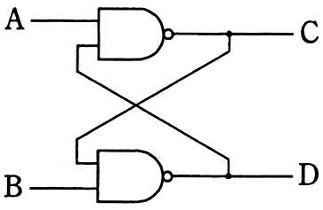

# 平成27年度秋期 問22（コンピュータシステム）

## 問題文

図の論理回路の動作の説明として，適切なものはどれか。

ア　A＝0，B＝0のとき，C及びDは前の状態を保持する。

イ　A＝0，B＝1のとき，Bの値を反映してD＝1になる。

ウ　A＝1，B＝0のとき，C＝1，D＝0になる。

エ　A＝1，B＝1のとき，C及びDは前の状態を保持する。

## 使用画像

## 解答と解説

**正解：エ**

図の回路は、2個のNANDゲートをたすき掛けに結合した、いわゆるNAND型SR（セット・リセット）ラッチである。上側のNANDゲートは入力A及び下側の出力Dを入力とし出力Cを、下側のNANDゲートは入力B及び上側の出力Cを入力とし出力Dを生成する。NAND型ラッチは各入力が0（Lレベル）のときにアクティブ（セット／リセット動作）となり、両方の入力が1（Hレベル）のときは非アクティブとなって、出力C・Dはそれまでの状態を保持するという性質を持つ。

各選択肢を検討する。

- ア：A＝0，B＝0はNAND型ラッチにとって禁止入力（両方アクティブ）に相当し、C＝D＝1となって状態保持にはならない。不適切。
- イ：A＝0，B＝1のときはA側（C出力側）がセットされCが1に固定される動作となり、Dの値がBの値をそのまま反映するわけではない。不適切。
- ウ：A＝1，B＝0のときはB側がアクティブになりDが1に、Cは0にはならず1になる（NANDの出力はB=0の入力があれば1）。記述のC＝1，D＝0は誤り。
- エ：A＝1，B＝1のときは両方の入力が非アクティブとなり、ラッチとして直前の状態を保持する。これがNAND型SRラッチの基本動作と一致する。

以上より、正しい記述はエである。

**IPA公式：エ**

