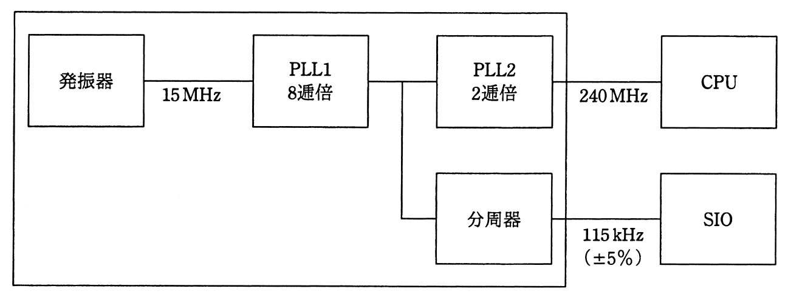

# 平成27年度秋期 問23（コンピュータシステム）

## 問題文

ワンチップマイコンにおける内部クロック発生器のブロック図を示す。15MHzの発振器と，内部のPLL1，PLL2及び分周器の組合せでCPUに240MHz，シリアル通信（SIO）に115kHzのクロック信号を供給する場合の分周器の値は幾らか。ここで，シリアル通信のクロック精度は±5％以内に収まればよいものとする。

ア　$1/2^{4}$

イ　$1/2^{6}$

ウ　$1/2^{8}$

エ　$1/2^{10}$

## 使用画像

## 解答と解説

**正解：エ**

図のブロック図より、15MHzの発振器出力はPLL1（8逓倍）を経て15MHz×8＝120MHzとなり、これがさらにPLL2（2逓倍）で120MHz×2＝240MHzとなってCPUに供給される（問題文の240MHzという条件と一致し、整合性が確認できる）。

分周器はPLL1とPLL2の間の120MHzのラインから分岐しており、この120MHzを分周してSIOに115kHz（±5%以内）のクロックを供給する。

必要な分周比を求めると、120MHz÷115kHz＝120,000,000÷115,000≒1043.5となる。選択肢はいずれも2のべき乗の逆数（1／2⁴，1／2⁶，1／2⁸，1／2¹⁰）であるため、1043.5に最も近い2のべき乗を確認する。

- 1／2⁴＝1／16 → 120MHz÷16＝7.5MHz（大きく外れる）
- 1／2⁶＝1／64 → 120MHz÷64＝1.875MHz（大きく外れる）
- 1／2⁸＝1／256 → 120MHz÷256＝468.75kHz（誤差が大きく±5%を超える）
- 1／2¹⁰＝1／1024 → 120MHz÷1024＝117.1875kHz

115kHzに対する許容範囲は±5%、すなわち109.25kHz～120.75kHzである。1／2¹⁰を用いた場合の117.1875kHzはこの範囲に収まる唯一の値であり、他の選択肢はいずれも範囲を大きく外れる。

以上より、分周器の値はエ（1／2¹⁰）が正しい。

**IPA公式：エ**

