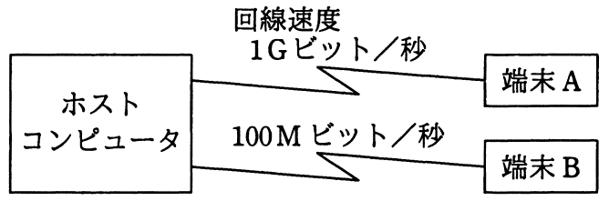

# 平成27年度秋期 問31（技術要素）

## 問題文

図のようなネットワーク構成のシステムにおいて，同じメッセージ長のデータをホストコンピュータとの間で送受信した場合のターンアラウンドタイムは，端末Aでは100ミリ秒，端末Bでは820ミリ秒であった。上り，下りのメッセージ長は同じ長さで，ホストコンピュータでの処理時間は端末A，端末Bのどちらから利用しても同じとするとき，端末Aからホストコンピュータへの片道の伝送時間は何ミリ秒か。ここで，ターンアラウンドタイムは，端末がデータを回線に送信し始めてから応答データを受信し終わるまでの時間とし，伝送時間は回線速度だけに依存するものとする。

ア　10

イ　20

ウ　30

エ　40

## 使用画像

