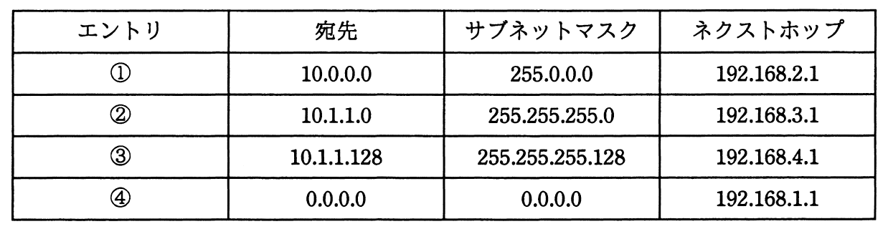

# 平成27年度秋期 問32（技術要素）

## 問題文

ルータがルーティングテーブルに①～④のエントリをもつとき，10.1.1.250宛てのパケットをルーティングする場合に選択するエントリはどれか。ここで，ルータは最長一致検索及び可変長サブネットマスクをサポートしているものとする。

ア　①

イ　②

ウ　③

エ　④

## 使用画像

## 解答と解説

**正解：ウ**

ルーティングにおける最長一致検索（longest prefix match）は、宛先アドレスに一致するエントリが複数存在する場合、サブネットマスクのビット長（プレフィックス長）が最も長い、すなわち最も範囲の狭いエントリを優先して選択する方式である。

宛先10.1.1.250について、各エントリとの一致を確認する。

- ①10.0.0.0/255.0.0.0（/8）：10.0.0.0～10.255.255.255の範囲に該当し、一致する。
- ②10.1.1.0/255.255.255.0（/24）：10.1.1.0～10.1.1.255の範囲に該当し、一致する。
- ③10.1.1.128/255.255.255.128（/25）：10.1.1.128～10.1.1.255の範囲に該当し、10.1.1.250はこの範囲に含まれるため一致する。
- ④0.0.0.0/0.0.0.0（デフォルトルート）：すべてのアドレスに一致する。

①②③④すべてが宛先に一致するが、プレフィックス長が最も長い（サブネットマスクが最も狭い＝ホスト部が最も少ない）のは③の/25である。最長一致検索では最も詳細な（狭い範囲を示す）エントリが優先されるため、③が選択される。

したがって、正解はウである。

**IPA公式：ウ**

