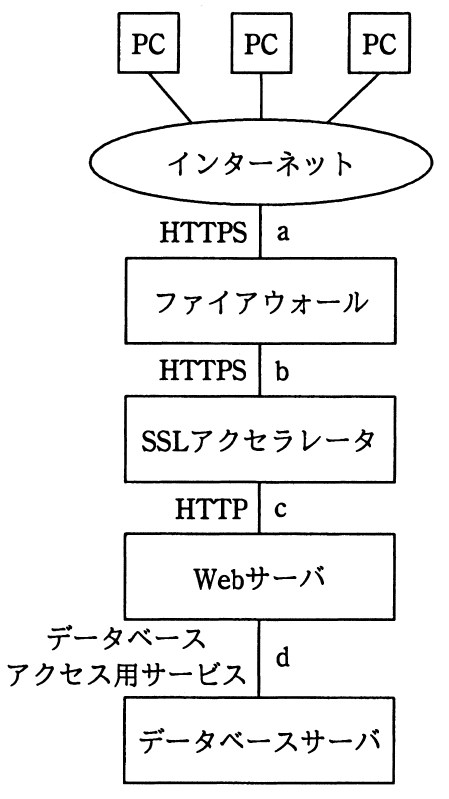

# 平成27年度秋期 問41（技術要素）

## 問題文

図のような構成と通信サービスのシステムにおいて，Webアプリケーションの脆（ぜい）弱性対策のためのWAFの設置場所として，最も適切な箇所はどこか。ここで，WAFには通信を暗号化したり，復号したりする機能はないものとする。

ア　a

イ　b

ウ　c

エ　d

## 使用画像

## 解答と解説

**正解：ウ**

WAF（Web Application Firewall）はWebアプリケーションの脆弱性を突く攻撃（SQLインジェクションやクロスサイトスクリプティングなど）を、通信内容（HTTPリクエスト・レスポンス）を検査して検知・防御する装置である。問題文の条件として「WAFには通信を暗号化・復号する機能はない」とあるため、WAFが通信内容を検査できるのは、暗号化されていない平文（HTTP）の区間に限られる。

図の構成を経路順に見ると、a区間（PC〜ファイアウォール間）はHTTPS、b区間（ファイアウォール〜SSLアクセラレータ間）もHTTPSであり、いずれも暗号化されているためWAFでは内容を検査できない。SSLアクセラレータでSSL/TLSの復号処理が行われた後のc区間（SSLアクセラレータ〜Webサーバ間）はHTTPとなっており、ここでは通信が平文化されているため、WAFが通信内容を検査してアプリケーション層の攻撃を検知することができる。d区間はWebサーバとデータベースサーバ間のデータベースアクセス用の通信であり、Webアプリケーションへのリクエストそのものではないため、WAFの設置場所としては適切ではない。

したがってWAFの設置場所として最も適切なのはc、すなわち選択肢ウとなる。

**IPA公式：ウ**

