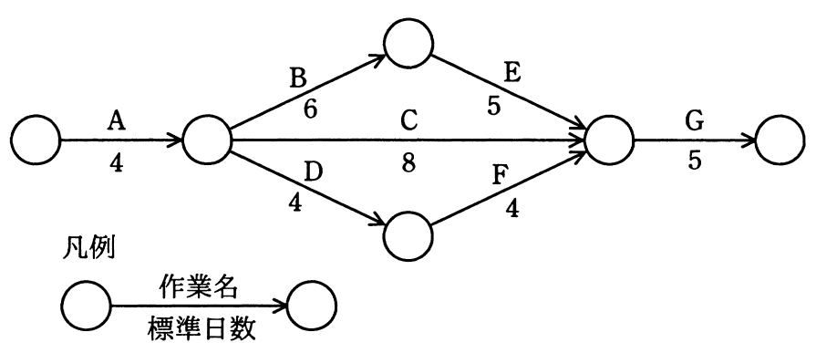
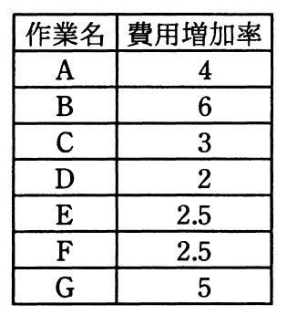

# 平成27年度秋期 問53（マネジメント）

## 問題文

図に示すとおりに作業を実施する予定であったが，作業Aで1日の遅れが生じた。各作業の費用増加率を表の値とするとき，当初の予定日数で終了するために掛かる増加費用を最も少なくするには，どの作業を短縮すべきか。ここで，費用増加率とは，作業を1日短縮するために要する増加費用のことである。

　

ア　B

イ　C

ウ　D

エ　E

## 使用画像

