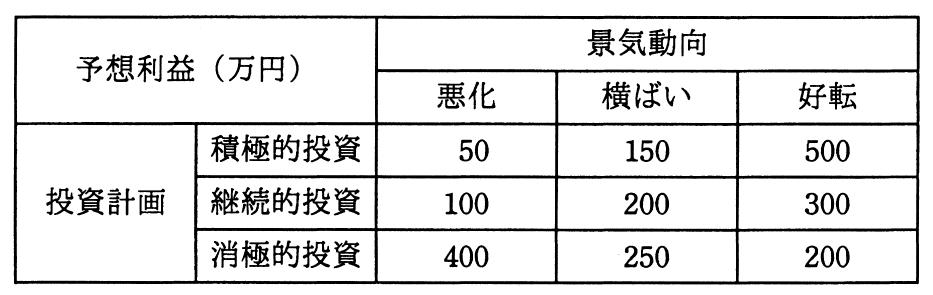

# 平成27年度秋期 問75（ストラテジ）

## 問題文

経営会議で来期の景気動向を議論したところ，景気は悪化する，横ばいである，好転するという三つの意見に完全に分かれてしまった。来期の投資計画について，積極的投資，継続的投資，消極的投資のいずれかに決定しなければならない。表の予想利益については意見が一致した。意思決定に関する記述のうち，適切なものはどれか。

ア　混合戦略に基づく最適意思決定は，積極的投資と消極的投資である。

イ　純粋戦略に基づく最適意思決定は，積極的投資である。

ウ　マクシマックス原理に基づく最適意思決定は，継続的投資である。

エ　マクシミン原理に基づく最適意思決定は，消極的投資である。

## 使用画像

