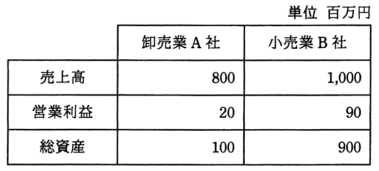

# 平成27年度秋期 問76（ストラテジ）

## 問題文

表から，卸売業A社と小売業B社の財務指標を比較したとき，卸売業A社について適切な記述はどれか。

ア　売上高，総資産の額がともに低く，総資産回転率も低い。

イ　売上高営業利益率が高く，総資産営業利益率も高い。

ウ　営業利益，総資産の額がともに低く，総資産営業利益率も低い。

エ　総資産回転率が高く，総資産営業利益率も高い。

## 使用画像

## 解答と解説

**正解：エ**

表の財務データ（単位：百万円）は次のとおりである。

| | 卸売業A社 | 小売業B社 |
|---|---|---|
| 売上高 | 800 | 1,000 |
| 営業利益 | 20 | 90 |
| 総資産 | 100 | 900 |

各指標を計算する。

総資産回転率＝売上高／総資産
- A社：800／100＝8.0（回）
- B社：1,000／900≒1.11（回）

総資産営業利益率＝営業利益／総資産×100
- A社：20／100×100＝20％
- B社：90／900×100＝10％

売上高営業利益率＝営業利益／売上高×100
- A社：20／800×100＝2.5％
- B社：90／1,000×100＝9％

以上より、A社は総資産回転率（8.0）がB社（約1.11）より大幅に高く、総資産営業利益率（20％）もB社（10％）より高い。したがって、エの「総資産回転率が高く、総資産営業利益率も高い」が正しい。

アは売上高・総資産がともに低く総資産回転率も低いとしているが、A社は総資産回転率がむしろ高いため誤り。イは売上高営業利益率がA社は2.5％とB社の9％より低いため誤り。ウは総資産営業利益率が低いとしているが、実際はA社の方が高いため誤り。

**IPA公式：エ**
