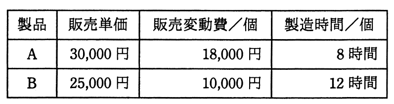

# 平成27年度秋期 問77（ストラテジ）

## 問題文

表のような製品A，Bを製造，販売する場合，考えられる営業利益は最大で何円になるか。ここで，機械の年間使用可能時間は延べ15,000時間とし，年間の固定費は製品A，Bに関係なく15,000,000円とする。

ア　3,750,000

イ　7,500,000

ウ　16,250,000

エ　18,750,000

## 使用画像

## 解答と解説

**正解：イ**

表のデータは次のとおりである。

| 製品 | 販売単価 | 販売変動費／個 | 製造時間／個 |
|---|---|---|---|
| A | 30,000円 | 18,000円 | 8時間 |
| B | 25,000円 | 10,000円 | 12時間 |

まず1個あたりの限界利益（貢献利益）を求める。
- 製品A：30,000－18,000＝12,000円／個
- 製品B：25,000－10,000＝15,000円／個

次に、制約条件である機械稼働時間（延べ15,000時間）1時間あたりの限界利益を求める。
- 製品A：12,000円÷8時間＝1,500円／時間
- 製品B：15,000円÷12時間＝1,250円／時間

機械使用時間が制約となる場合、時間当たりの限界利益が大きい製品を優先的に製造すべきであり、製品Aの方が製品Bより時間効率が良い（1,500円／時 ＞ 1,250円／時）。したがって、機械使用可能時間15,000時間をすべて製品Aの製造に充てるのが最適となる。

製品Aの最大生産可能数＝15,000時間÷8時間／個＝1,875個

このときの限界利益合計＝12,000円×1,875個＝22,500,000円

営業利益＝限界利益合計－固定費＝22,500,000円－15,000,000円＝7,500,000円

以上の計算より、考えられる最大の営業利益は7,500,000円となり、正解はイである。すべてを製品Bで製造した場合は15,000÷12＝1,250個、限界利益15,000円×1,250個＝18,750,000円、営業利益＝18,750,000－15,000,000＝3,750,000円（選択肢ア相当）となり、製品Aに集中する方が有利であることが確認できる。

**IPA公式：イ**
