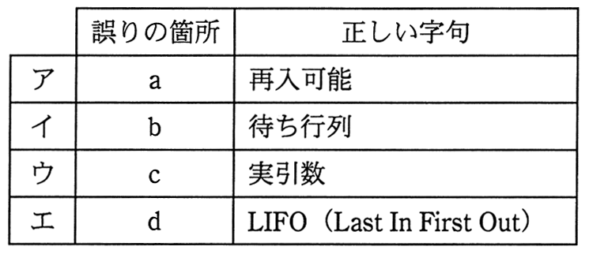

# 平成27年度春期 問7（基礎理論）

## 問題文

プログラムの実行に関する次の記述の下線部a〜dのうち，いずれかに誤りがある。誤りの箇所と正しい字句の適切な組合せはどれか。

自分自身を呼び出すことができるプログラムは，_a再帰的であるという。このようなプログラムを実行するときは，_bスタックに局所変数，_c仮引数及び戻り番地を格納して呼び出し，復帰するときは_dFIFO（First In First Out）方式で格納したデータを取り出して復元する必要がある。

## 使用画像

## 解答と解説

**正解：エ**

問題文の記述を確認する。

- 下線部a「再帰的である」：自分自身を呼び出すことができるプログラムは再帰的であるという表現は正しい。
- 下線部b「スタックに局所変数」：再帰呼び出しでは、呼び出しごとに独立した局所変数の領域が必要となるため、後入れ先出し（LIFO）構造のスタックに局所変数を積む、という記述は正しい。
- 下線部c「仮引数及び戻り番地を格納」：関数呼び出し時には、仮引数（実引数の値）と、呼び出し元に戻るためのリターンアドレス（戻り番地）もスタックに格納される。この記述も正しい。
- 下線部d「FIFO方式で格納したデータを取り出して復元」：スタックは後入れ先出し（LIFO：Last In First Out）方式であり、先入れ先出し（FIFO：First In First Out）ではない。再帰呼び出しから復帰する際は、最後に呼び出された（最後に積まれた）関数の情報から順に取り出す必要があるため、正しくは「LIFO方式」でなければならない。

したがって誤りの箇所はd、正しい字句は「LIFO（Last In First Out）」であり、画像の対応表と照合すると選択肢エに一致する。

- ア：aは誤りではないため不適切。
- イ：bは誤りではないため不適切。
- ウ：cは誤りではないため不適切。
- エ：dが誤りであり、正しい字句はLIFOであるため適切。

以上より、正解はエである。

**IPA公式：エ**

