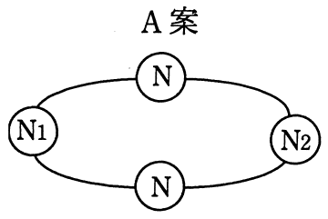
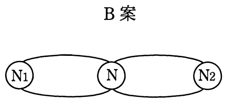

# 平成27年度春期 問15（コンピュータシステム）

## 問題文

ノードN1とノードN2で通信を行うデータ伝送網がある。図のようにN1とN2間にノードNを入れてA案，B案で伝送網を構成したとき，システム全体の稼働率の比較として適切なものはどれか。ここで，各ノード間の経路（パス）の稼働率は，全て等しくρ（0＜ρ＜1）であるものとする。また，各ノードは故障しないものとする。

　

ア　A案，B案の稼働率の大小関係は，ρの値によって変化する。

イ　A案，B案の稼働率は等しい。

ウ　A案の方が，B案よりも稼働率が高い。

エ　B案の方が，A案よりも稼働率が高い。

## 使用画像

