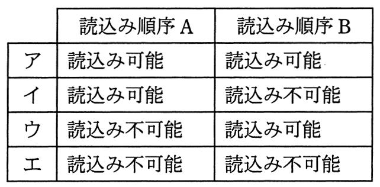

# 平成27年度春期 問18（コンピュータシステム）

## 問題文

500kバイトの連続した空き領域に，複数のプログラムモジュールをオーバレイ方式で読み込んで実行する。読込み順序Aと読込み順序Bにおいて，最後の120kバイトのモジュールを読み込む際，読込み可否の組合せとして適切なものはどれか。ここで，数値は各モジュールの大きさをkバイトで表したものであり，モジュールを読み込む領域は，ファーストフイット方式で求めることとする。

〔読込み順序A〕

　100 → 200 → 200解放 → 150 → 100解放 → 80 → 100 → 120

〔読込み順序B〕

　200 → 100 → 150 → 100解放 → 80 → 200解放 → 100 → 120

## 使用画像

