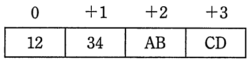
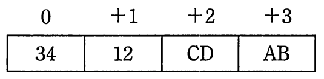

# 平成27年度春期 問21（コンピュータシステム）

## 問題文

16進数ABCD1234をリトルエンディアンで4バイトのメモリに配置したものはどれか。ここで，0〜＋3はバイトアドレスのオフセット値である。

ア　

イ　

ウ　

エ

## 使用画像

## 解答と解説

**正解：イ**

16進数ABCD1234は、バイト単位に区切ると上位から順に「AB」「CD」「12」「34」の4バイトになる。これをアドレス0，+1，+2，+3の並びに格納する方式には、上位バイトから順に格納するビッグエンディアンと、下位バイト（最下位バイト）から順に格納するリトルエンディアンがある。

ビッグエンディアンでは、アドレス0から「AB」「CD」「12」「34」の順に格納される。

リトルエンディアンでは、値の最下位バイトである「34」がアドレス0（最も若いアドレス）に置かれ、続いて「12」「CD」「AB」の順、すなわちアドレス0から「34」「12」「CD」「AB」の順に格納される。

画像を確認すると、02.gifが「0：34，+1：12，+2：CD，+3：AB」という配置になっており、これがリトルエンディアンでの格納結果と一致する。01.gifはビッグエンディアン（0：12，+1：34，+2：AB，+3：CD）とは異なる並びであり、04.gifは「0：AB，+1：CD，+2：12，+3：34」でビッグエンディアンの配置に該当する。

したがって、リトルエンディアンで4バイトのメモリに配置したものは「イ」（02.gif相当の配置）である。

**IPA公式：イ**

