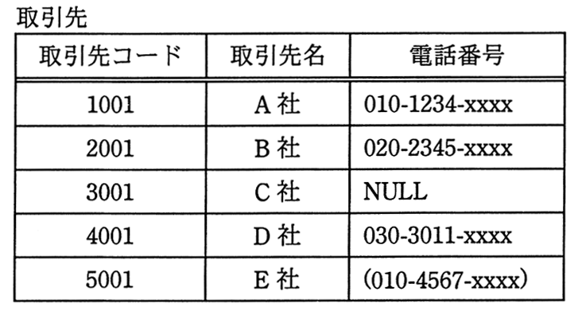

# 平成27年度春期 問26（技術要素）

## 問題文

“電話番号”列にNULLを含む“取引先”表に対して，SQL文を実行した結果の行数は幾つか。

〔SQL文〕

　SELECT * FROM 取引先 WHERE 電話番号 NOT LIKE '010%'

ア　1

イ　2

ウ　3

エ　4

## 使用画像

## 解答と解説

**正解：ウ**

このSQL文は「電話番号がNOT LIKE '010%'」、すなわち「電話番号が'010'で始まらない行」を抽出するものである。ただし、NULLを含む列に対する比較演算（LIKE／NOT LIKEを含む）の結果は必ず「不明（UNKNOWN）」となり、WHERE句ではUNKNOWNはTRUEとして扱われない（＝抽出対象外となる）点に注意が必要である。

“取引先”表の各行を検証すると次のようになる。

- 取引先コード1001（A社）：電話番号「010-1234-xxxx」→ '010%'に一致するのでNOT LIKEはFALSE → 除外
- 取引先コード2001（B社）：電話番号「020-2345-xxxx」→ '010%'に一致しないのでNOT LIKEはTRUE → 抽出
- 取引先コード3001（C社）：電話番号がNULL → 比較結果はUNKNOWN → 除外
- 取引先コード4001（D社）：電話番号「030-3011-xxxx」→ '010%'に一致しないのでNOT LIKEはTRUE → 抽出
- 取引先コード5001（E社）：電話番号「(010-4567-xxxx)」→ 先頭が"("であり文字列として'010'で始まっていないためNOT LIKEはTRUE → 抽出

以上より、抽出される行はB社、D社、E社の3行となる。

したがって、実行結果の行数は3であり、正解は「ウ」である。

**IPA公式：ウ**

