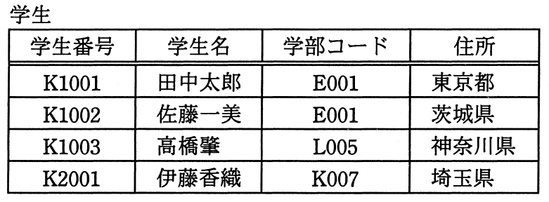

# 平成27年度春期 問28（技術要素）

## 問題文

“学生”表が次のSQL文で定義されているとき，検査制約の違反となるSQL文はどれか。

CREATE TABLE 学生(学生番号 CHAR(5) PRIMARY KEY,

　　　　学生名 CHAR(16),

　　　　学部コード CHAR(4),

　　　　住所 CHAR(16),

　　　　CHECK (学生番号 LIKE 'K%'))

ア　DELETE FROM 学生 WHERE 学生番号 = 'K1002'

イ　INSERT INTO 学生 VALUES ('J2002','渡辺次郎','M006','東京都')

ウ　SELECT * FROM 学生 WHERE 学生番号 = 'K1001'

エ　UPDATE 学生 SET 学部コード = 'N001' WHERE 学生番号 LIKE 'K%'

## 使用画像

## 解答と解説

**正解：イ**

“学生”表の定義には、CHECK (学生番号 LIKE 'K%') という検査制約（CHECK制約）が設定されている。これは、学生番号列の値が必ず「K」で始まる文字列でなければならないことを表す。この制約は、新たに行を挿入（INSERT）する場合や、学生番号を更新（UPDATE）する場合に、その新しい値が条件を満たしているかどうかがチェックされる。

イの「INSERT INTO 学生 VALUES ('J2002','渡辺次郎','M006','東京都')」は、学生番号として'J2002'を挿入しようとしており、これは'K'で始まっていないためCHECK制約に違反し、エラーとなる。

ア「DELETE FROM 学生 WHERE 学生番号 = 'K1002'」は既存行の削除であり、CHECK制約は新しく格納される値に対するチェックなので、削除操作自体は制約違反にならない。

ウ「SELECT * FROM 学生 WHERE 学生番号 = 'K1001'」は検索（参照）操作であり、データの追加・変更を伴わないためCHECK制約とは無関係である。

エ「UPDATE 学生 SET 学部コード = 'N001' WHERE 学生番号 LIKE 'K%'」は学部コード列を更新するものであり、学生番号列自体は変更されず、対象行はすべて既に'K'で始まる学生番号を持つため、CHECK制約には違反しない。

したがって、検査制約の違反となるSQL文は「イ」である。

**IPA公式：イ**

