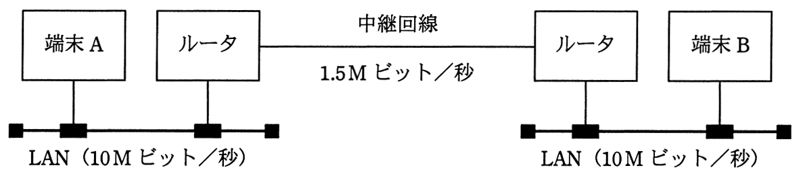

# 平成27年度春期 問32（技術要素）

## 問題文

図のように，2台の端末がルータと中継回線で接続されているとき，端末Aがフレームを送信し始めてから，端末Bがフレームを受信し終わるまでの時間は，およそ何ミリ秒か。

〔条件〕

フレーム長：LAN，中継回線ともに1,500バイト

LANの伝送速度：10Mビット／秒

中継回線の伝送速度：1.5Mビット／秒

1フレームのルータ処理時間：両ルータともに0.8ミリ秒

ア　3

イ　6

ウ　10

エ　12

## 使用画像

## 解答と解説

**正解：エ**

図の構成は「端末A－LAN(10Mビット/秒)－ルータ－中継回線(1.5Mビット/秒)－ルータ－LAN(10Mビット/秒)－端末B」である。ルータでは受信したフレームを一旦バッファに蓄積してから次の区間へ送出する蓄積交換方式（ストア・アンド・フォワード方式）であるため、各区間の伝送時間とルータの処理時間を単純に加算して求める。

各区間の伝送時間は「フレーム長（ビット）÷伝送速度」で計算する。フレーム長は1,500バイト＝1,500×8＝12,000ビットである。

- 端末A～ルータ1間（LAN、10Mビット/秒）：12,000／10,000,000＝1.2ミリ秒
- ルータ1～ルータ2間（中継回線、1.5Mビット/秒）：12,000／1,500,000＝8ミリ秒
- ルータ2～端末B間（LAN、10Mビット/秒）：12,000／10,000,000＝1.2ミリ秒
- ルータ処理時間：0.8ミリ秒×2台＝1.6ミリ秒

これらを合計すると、1.2＋8＋1.2＋1.6＝12ミリ秒となる。

したがって、端末Aがフレームを送信し始めてから端末Bが受信し終わるまでの時間はおよそ12ミリ秒であり、正解はエである。

**IPA公式：エ**

