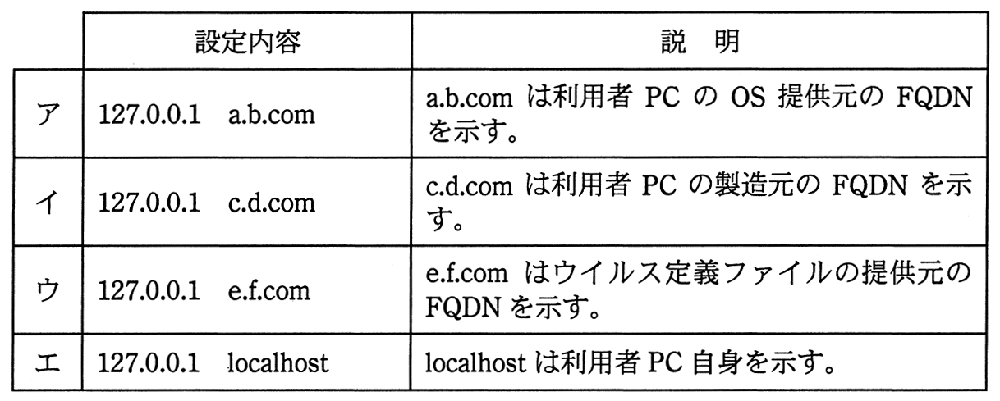

# 平成27年度春期 問45（技術要素）

## 問題文

利用者PCがボットに感染しているかどうかをhostsファイルの改ざんの有無で確認するとき，hostsファイルが改ざんされていないと判断できる設定内容はどれか。ここで，hostsファイルには設定内容が1行だけ書かれており，利用者及びシステム管理者は，これまでにhostsファイルを変更していないものとする。

## 使用画像

## 解答と解説

**正解：エ**

hostsファイルは、ドメイン名（FQDN）とIPアドレスを対応付けるローカルの名前解決ファイルであり、DNSより優先して参照される。ボット（マルウェア）は、C&Cサーバへの通信を確立したり、ウイルス対策ソフトの定義ファイル更新やOS/ソフトウェアのアップデートを妨害したりする目的で、正規のFQDN（更新サーバやベンダのFQDNなど）をループバックアドレス（127.0.0.1など、実在しない・到達しないアドレス）に強制的に対応付けるようhostsファイルを改ざんすることがある。

問題文の前提では、利用者・管理者ともにこれまでhostsファイルを変更していないとされているため、初期状態（改ざんされていない状態）で妥当な内容かどうかを判断する。

- ア〜ウは、127.0.0.1（自分自身を指すループバックアドレス）に対して、OS提供元・PC製造元・ウイルス定義ファイル提供元といった外部の実在するFQDNを割り当てている。これは、当該サービスへの通信を自分自身（何もない場所）へ迂回させ、アップデート等を無効化する典型的な改ざんパターンである。
- エ の「127.0.0.1 localhost」は、127.0.0.1（ループバックアドレス）に「localhost」という自分自身を指す名前を対応付けるものであり、これはOSの標準的なデフォルト設定そのものである。改ざんではなく、通常の初期設定内容と一致する。

したがって、改ざんされていないと判断できる設定内容はエである。

**IPA公式：エ**
