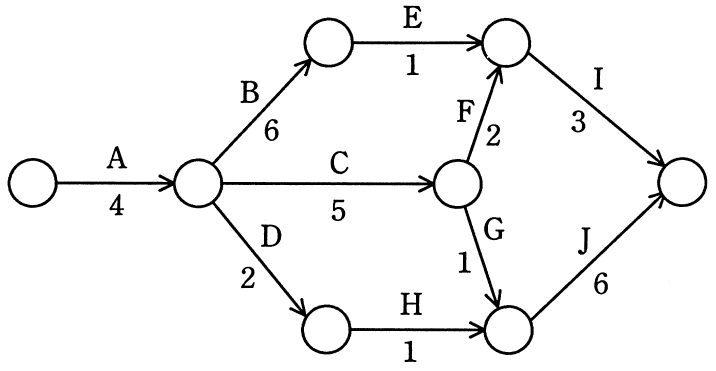
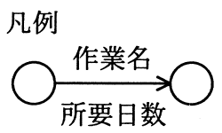

# 平成27年度春期 問51（マネジメント）

## 問題文

PERT図で表されるプロジェクトにおいて，プロジェクト全体の所要日数を1日短縮できる施策はどれか。

　

ア　作業BとFを1日ずつ短縮する。

イ　作業Bを1日短縮する。

ウ　作業Iを1日短縮する。

エ　作業Jを1日短縮する。

## 使用画像

## 解答と解説

**正解：エ**

まず開始ノードから終了ノードまでの全経路の所要日数を求める。

- A-B-E-I：4+6+1+3＝14日
- A-C-F-I：4+5+2+3＝14日
- A-C-G-J：4+5+1+6＝16日（最長＝クリティカルパス）
- A-D-H-J：4+2+1+6＝13日

プロジェクト全体の所要日数はクリティカルパスであるA-C-G-J経路の16日で決まる。全体を1日短縮するには、この経路上の作業（A・C・G・Jのいずれか）を短縮する必要があり、かつ短縮後も他の経路がボトルネックにならないことを確認する。

- ア（B・Fを1日短縮）：BはA-B-E-I経路（14日）、FはA-C-F-I経路（14日）上の作業で、いずれもクリティカルパスA-C-G-J上にない。短縮してもクリティカルパスは16日のまま変わらず、全体日数は短縮されない。
- イ（Bを1日短縮）：Bはクリティカルパス上にないため、全体日数は短縮されない。
- ウ（Iを1日短縮）：IはA-B-E-I・A-C-F-Iの経路上（各14日）にあるが、クリティカルパスA-C-G-J上にはない。短縮しても全体日数は変わらない。
- エ（Jを1日短縮）：Jはクリティカルパス上の作業。短縮後の各経路は、A-B-E-I＝14日、A-C-F-I＝14日、A-C-G-J＝15日、A-D-H-J＝12日となり、最長経路は15日となる。他経路がボトルネックになることもなく、全体日数が16日から15日へ1日短縮される。

したがって正解はエ。

**IPA公式：エ**

