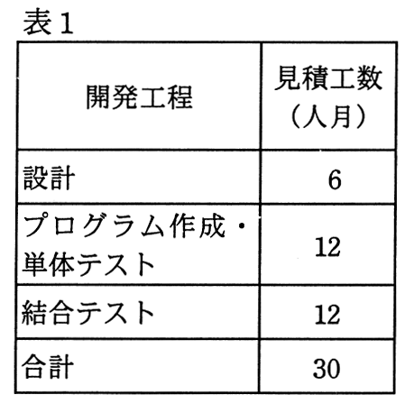
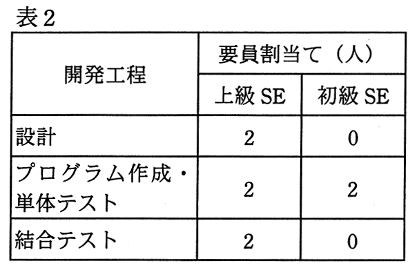

# 平成27年度春期 問53（マネジメント）

## 問題文

あるプログラムの設計から結合テストまでの作業について，開発工程ごとの見積工数を表1に示す。また，開発工程ごとの上級SEと初級SEの要員割当てを表2に示す。上級SEは，初級SEに比べて，プログラム作成・単体テストについて2倍の生産性を有する。表1の見積工数は，上級SEの生産性を基に算出している。

　全ての開発工程に対して，上級SEを1人追加して割り当てると，この作業に要する期間は何か月短縮できるか。ここで，開発工程の期間は重複させないものとし，要員全員が1か月当たり1人月の工数を投入するものとする。

　

ア　1

イ　2

ウ　3

エ　4

## 使用画像

