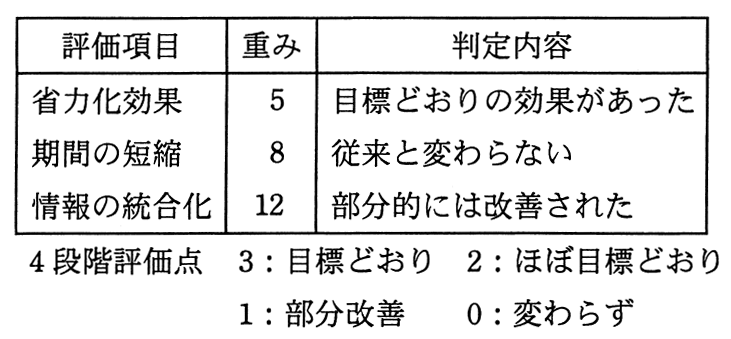

# 平成27年度春期 問65（ストラテジ）

## 問題文

定性的な評価項目を定量化するために評価点を与える方法がある。表に示す4段階評価を用いた場合，重み及び判定内容から評価されるシステム全体の目標達成度は何％となるか。

ア　27

イ　36

ウ　43

エ　52

## 使用画像

## 解答と解説

**正解：イ**

表の重み（省力化効果5、期間の短縮8、情報の統合化12、合計25）と、判定内容に対応する4段階評価点（3：目標どおり、2：ほぼ目標どおり、1：部分改善、0：変わらず）を用いて計算する。

各評価項目の判定は次のとおり。
- 省力化効果：「目標どおりの効果があった」→評価点3
- 期間の短縮：「従来と変わらない」→評価点0
- 情報の統合化：「部分的には改善された」→評価点1

加重評価点の合計 = 5×3 + 8×0 + 12×1 = 15 + 0 + 12 = 27

達成可能な最大点（全項目が評価点3の場合）= 重みの合計25 × 3 = 75

目標達成度 = 27 ÷ 75 × 100 ≒ 36％

したがって、システム全体の目標達成度は36％となり、イが正解となる。

**IPA公式：イ**

