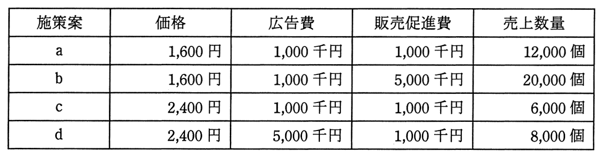

# 平成27年度春期 問69（ストラテジ）

## 問題文

施策案a〜dのうち，利益が最も高くなるマーケティングミックスはどれか。ここで，広告費と販売促進費は固定費とし，1個当たりの変動費は1,000円とする。

ア　a

イ　b

ウ　c

エ　d

## 使用画像

## 解答と解説

**正解：ウ**

マーケティングミックスの利益比較問題である。各施策案の利益は次の式で求められる。

利益 ＝（価格 − 1個当たり変動費）× 売上数量 − 広告費 − 販売促進費

画像に示された各施策案のデータを用いて計算する（金額の単位は円）。

- 施策案a：価格1,600円、広告費1,000千円、販売促進費1,000千円、売上数量12,000個
  利益 ＝ (1,600−1,000)×12,000 − 1,000,000 − 1,000,000 ＝ 7,200,000 − 2,000,000 ＝ **5,200,000円**

- 施策案b：価格1,600円、広告費1,000千円、販売促進費5,000千円、売上数量20,000個
  利益 ＝ (1,600−1,000)×20,000 − 1,000,000 − 5,000,000 ＝ 12,000,000 − 6,000,000 ＝ **6,000,000円**

- 施策案c：価格2,400円、広告費1,000千円、販売促進費1,000千円、売上数量6,000個
  利益 ＝ (2,400−1,000)×6,000 − 1,000,000 − 1,000,000 ＝ 8,400,000 − 2,000,000 ＝ **6,400,000円**

- 施策案d：価格2,400円、広告費5,000千円、販売促進費1,000千円、売上数量8,000個
  利益 ＝ (2,400−1,000)×8,000 − 5,000,000 − 1,000,000 ＝ 11,200,000 − 6,000,000 ＝ **5,200,000円**

4案の利益を比較すると、c（6,400,000円）が最も高い。したがって、利益が最も高くなるマーケティングミックスはcであり、正解はウである。

**IPA公式：ウ**

