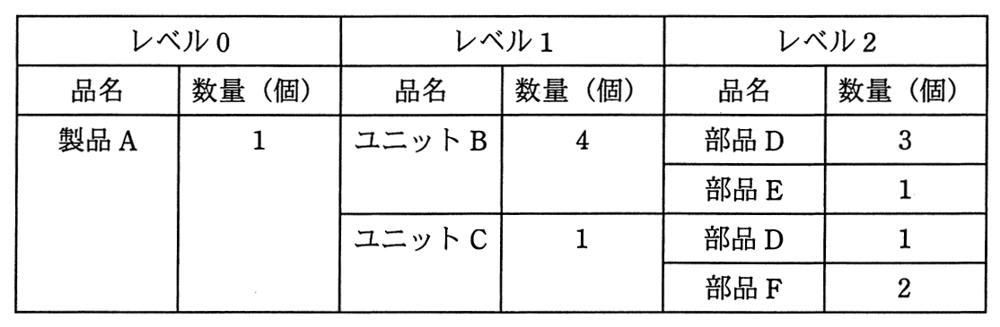

# 平成27年度春期 問71（ストラテジ）

## 問題文

ある期間の生産計画において，図の部品表で表される製品Aの需要量が10個であるとき，部品Dの正味所要量は何個か。ここで，ユニットBの在庫残が5個，部品Dの在庫残が25個あり，他の在庫残，仕掛残，注文残，引当残などはないものとする。

ア　80

イ　90

ウ　95

エ　105

## 使用画像

## 解答と解説

**正解：イ**

部品表（部品構成表）に基づき、製品A 10個の生産に必要な部品Dの正味所要量を求める。

まず中間品であるユニットB・ユニットCの総所要量と正味所要量を求める。
- ユニットBの総所要量 = 製品A 10個 × 4個/製品 = 40個
- ユニットBの正味所要量 = 総所要量40個 − 在庫残5個 = 35個
- ユニットCの総所要量 = 製品A 10個 × 1個/製品 = 10個（在庫残なし）
- ユニットCの正味所要量 = 10個

部品Dは、ユニットBの構成部品として3個/ユニット、ユニットCの構成部品として1個/ユニット使用される。部品Dの総所要量は、上位品目の「正味所要量」を基準に積算する（在庫を持つユニットBは正味所要量分だけ生産されるため）。

- ユニットB経由の部品D所要量 = 35個 × 3個/ユニット = 105個
- ユニットC経由の部品D所要量 = 10個 × 1個/ユニット = 10個
- 部品Dの総所要量 = 105個 + 10個 = 115個

部品Dの在庫残25個を差し引く。

- 部品Dの正味所要量 = 115個 − 25個 = 90個

よって正解は90個であり、イが正しい。

**IPA公式：イ**

