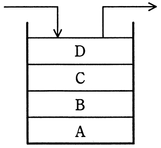

# 平成28年度秋期 問3（基礎理論）

## 問題文

逆ポーランド表記法で表された式を評価する場合，途中の結果を格納するためのスタックを用意し，式の項や演算子を左から右に順に入力し処理する。スタックが図の状態のとき，入力が演算子となった。このときに行われる演算はどれか。ここで，演算は中置表記法で記述するものとする。

ア　A　演算子　B

イ　B　演算子　A

ウ　C　演算子　D

エ　D　演算子　C

## 使用画像

## 解答と解説

**正解：ウ**

逆ポーランド表記法（後置記法）では、演算子を評価する際にスタックからオペランドを2つ取り出し、先にpop（取り出）した値を右オペランド、後にpop（取り出）した値を左オペランドとして中置式を組み立てる。これはスタックがLIFO（後入れ先出し）の構造であり、後からpushされた値ほど後の演算子に近い（直近の）オペランドとして扱われるためである。

図のスタックは、下から順にA, B, C, Dが積まれており、Dが一番上（最後にpushされた値）、Cがその下にある。

入力として演算子が来ると、
1. まずスタックの一番上のD（第2オペランド＝右側）をpopする
2. 次にC（第1オペランド＝左側）をpopする
3. 中置表記で「C 演算子 D」として評価し、その結果を新たにpushする

したがって、行われる演算は「C　演算子　D」となる。

**IPA公式：ウ**
