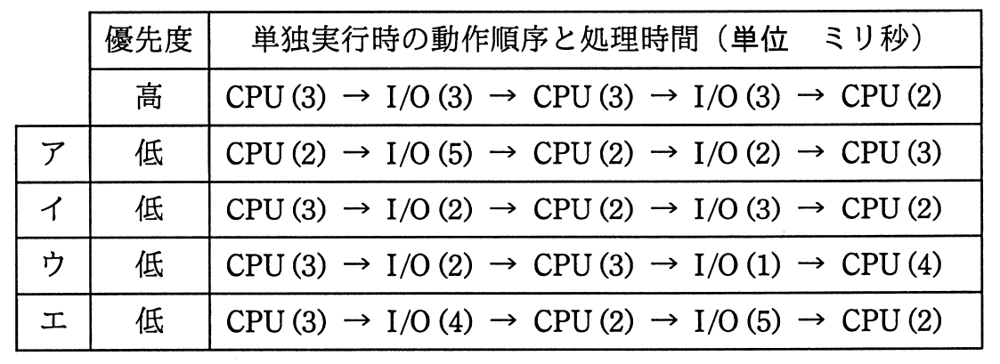

# 平成28年度秋期 問17（コンピュータシステム）

## 問題文

五つのタスクを単独で実行した場合のCPUと入出力装置（I/O）の動作順序と処理時間は，表のとおりである。優先度“高”のタスクと，優先度“低”のタスクのうち一つだけを同時に実行する。実行を開始してから，両方のタスクの実行が完了するまでの間のCPUの遊休時間が最も短いのは，どの優先度“低”のタスクとの組合せか。ここで，I/Oは競合せず，OSのオーバヘッドは考慮しないものとする。

　また，表の（）内の数字は処理時間を示すものとする。

## 使用画像

