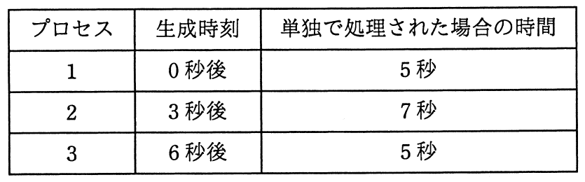

# 平成28年度秋期 問19（コンピュータシステム）

## 問題文

タイムクウォンタムが2秒のラウンドロビン方式で処理されるタイムシェアリングシステムにおいて，プロセス1〜3が逐次生成されるとき，プロセス2が終了するのはプロセス2の生成時刻から何秒後か。ここで，各プロセスはCPU処理だけで構成され，OSのオーバヘッドは考慮しないものとする。また，新しいプロセスの生成と中断されたプロセスの再開が同時に生じた場合には，新しく生成されたプロセスを優先するものとする。

ア　12

イ　14

ウ　16

エ　17

## 使用画像

## 解答と解説

**正解：イ**

タイムクウォンタム2秒のラウンドロビン方式で，プロセス1（生成0秒後，所要5秒），プロセス2（生成3秒後，所要7秒），プロセス3（生成6秒後，所要5秒）の実行順序を時系列で追跡する。新規生成プロセスと中断され再開待ちのプロセスが同時にレディキューへ入る場合は，新規生成プロセスを優先してキューの前に並べる。

1. 時刻0〜2：プロセス1を実行（残り3秒）。実行中の時刻3にプロセス2が生成され，キュー末尾に追加される。
2. 時刻2〜4：プロセス1を実行（残り1秒）。時刻4，プロセス1は中断されキュー末尾へ。キューは［プロセス2，プロセス1］の順（プロセス2は時刻3から待機済みのため先）。
3. 時刻4〜6：プロセス2を実行（残り5秒）。ちょうど時刻6にプロセス3が生成される。プロセス2の量子も時刻6で終了するため，同時に発生するが，新規生成のプロセス3が優先されキューの前に入る。キューは［プロセス1，プロセス3，プロセス2］。
4. 時刻6〜7：プロセス1を実行し，残り1秒を消化して完了（生成から7秒後に終了）。
5. 時刻7〜9：プロセス3を実行（残り3秒）。
6. 時刻9〜11：プロセス2を実行（残り3秒）。
7. 時刻11〜13：プロセス3を実行（残り1秒）。
8. 時刻13〜15：プロセス2を実行（残り1秒）。
9. 時刻15〜16：プロセス3を実行し，残り1秒を消化して完了（時刻16）。
10. 時刻16〜17：プロセス2を実行し，残り1秒を消化して完了（時刻17）。

以上より，プロセス2が終了するのは時刻17であり，プロセス2の生成時刻（3秒後）からは 17−3＝14秒後 となる。

これは選択肢イの「14」と一致する。他の選択肢（12，16，17）は，量子終了と新規生成が同時に起きた時刻6での優先順位の扱いを誤ったり，各プロセスの残余時間の管理を誤った場合に生じやすい値である。

**IPA公式：イ**

