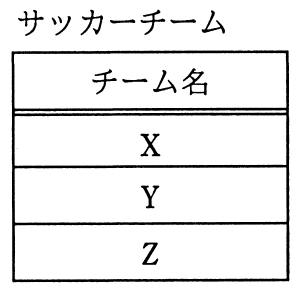
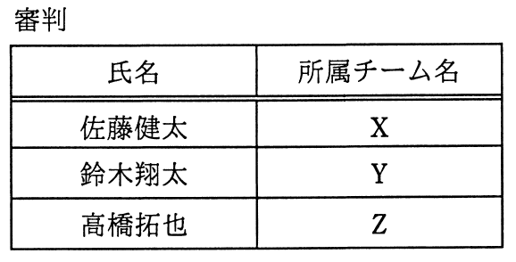
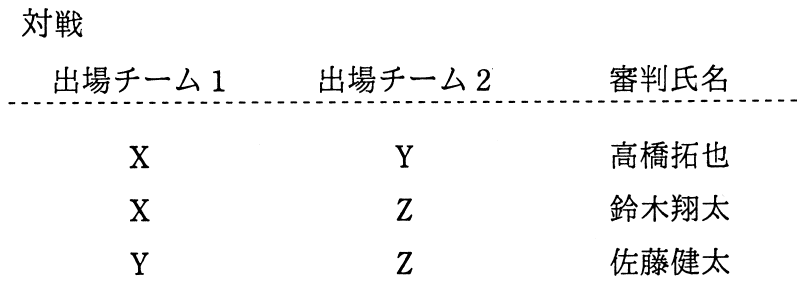

# 平成28年度秋期 問29（技術要素）

## 問題文

“サッカーチーム”表と“審判”表から，条件を満たす対戦を導出するSQL文のaに入れる字句はどれか。

〔条件〕

　・出場チーム1のチーム名は出場チーム2のチーム名よりもアルファベット順で先にくる。

　・審判は，所属チームの対戦を担当することはできない。

〔SQL文〕

　SELECT A.チーム名 AS 出場チーム1, B.チーム名 AS 出場チーム2,

　　　　C.氏名 AS 審判氏名

　　　　FROM サッカーチーム AS A, サッカーチーム AS B, 審判 AS C

　　　　WHERE A.チーム名 < B.チーム名 AND    a   

ア　(A.チーム名 <> C.所属チーム名 OR B.チーム名<> C.所属チーム名)

イ　C.所属チーム名 NOT IN (A.チーム名, B.チーム名)

ウ　EXISTS

    (SELECT * FROM 審判 AS D WHERE A.チーム名 <> D.所属チーム名

     AND B.チーム名<> D.所属チーム名)

エ　NOT EXISTS

    (SELECT * FROM 審判 AS D WHERE A.チーム名 = D.所属チーム名

     OR B.チーム名 = D.所属チーム名)

## 使用画像

