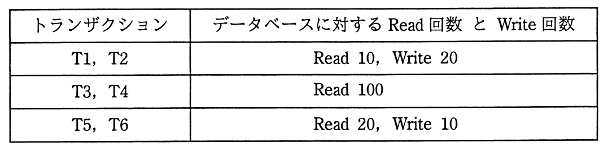
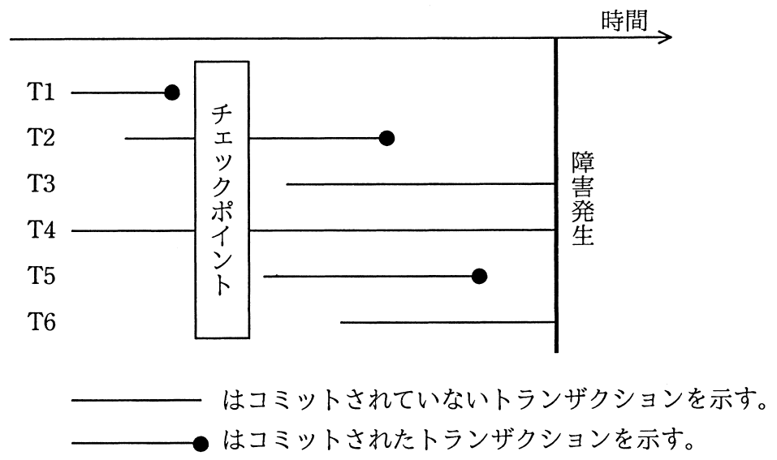
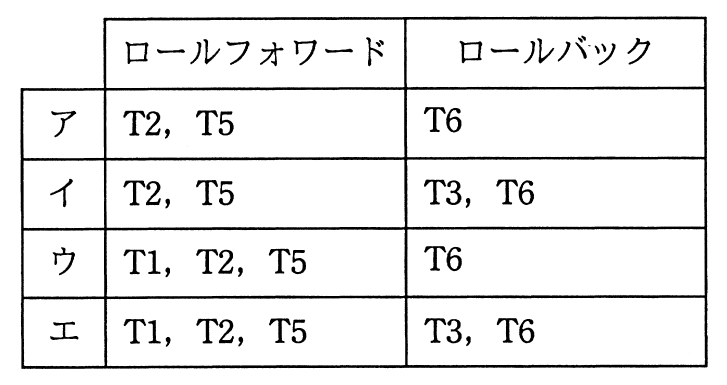

# 平成28年度秋期 問30（技術要素）

## 問題文

DBMSをシステム障害発生後に再立上げするとき，ロールフォワードすべきトランザクションとロールバックすべきトランザクションの組合せとして，適切なものはどれか。ここで，トランザクションの中で実行される処理内容は次のとおりとする。

## 使用画像

## 解答と解説

**正解：ア**

障害からの再立上げ処理では、チェックポイント取得時点を基準に、各トランザクションの状態に応じてロールフォワード（更新後ログを使って処理をやり直す）かロールバック（更新前ログを使って処理を取り消す）かを判断する。

タイムチャートを確認すると、各トランザクションの状態は次のとおりである。

- T1：チェックポイント取得前にコミット済み。チェックポイント取得時にデータベースへの反映が保証されるため、再実行の対象外（ロールフォワード・ロールバックいずれも不要）。
- T2：チェックポイント取得後に開始し、障害発生前にコミット済み。チェックポイント以降の更新はディスクへの反映が保証されていないため、更新後ログでロールフォワードが必要。
- T3：チェックポイント取得前から開始し、障害発生時点でもコミットされていない（未完了）。ただし表からT3はRead 100のみでWriteを行っていないため、データベースの更新内容に影響がなく、ロールバック対象として扱う必要がない（更新がないので取り消す内容もない）。
- T4：T3と同様にチェックポイント取得前から継続しているが、Read 100のみでWriteがないため、ロールバック対象には含まれない。
- T5：チェックポイント取得後に開始し、障害発生前にコミット済み。T2と同様にロールフォワードが必要。
- T6：チェックポイント取得後に開始し、障害発生時点で未コミット。Write処理を伴っているため、更新前ログを使ってロールバックが必要。

以上から、ロールフォワードすべきトランザクションはT2・T5、ロールバックすべきトランザクションはT6のみとなり、アの組合せ「ロールフォワード：T2, T5／ロールバック：T6」が正しい。

イ・エはT3もロールバック対象に含めている点で誤り（T3はWriteを行っていないため取消不要）。ウ・エはT1をロールフォワード対象に含めている点で誤り（T1はチェックポイント前にコミット済みで再実行不要）。

**IPA公式：ア**

