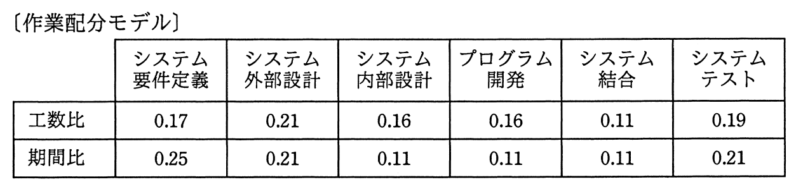

# 平成28年度秋期 問53（マネジメント）

## 問題文

過去のプロジェクトの開発実績から構築した作業配分モデルがある。システム要件定義からシステム内部設計までをモデルどおりに進めて228日で完了し，プログラム開発を開始した。現在，200本のプログラムのうち100本のプログラム開発を完了し，残りの100本は未着手の状況である。プログラム開発以降もモデルどおりに進捗すると仮定するとき，プロジェクトの完了まで，あと何日掛かるか。ここで，各プログラムの開発に掛かる工数及び期間は，全てのプログラムで同一であるものとする。

ア　140

イ　150

ウ　161

エ　172

## 使用画像

## 解答と解説

**正解：イ**

作業配分モデルの「期間比」を用いて、プロジェクト全体の期間を求め、残り工程の所要日数を計算する。

システム要件定義からシステム内部設計までの期間比の合計は、0.25＋0.21＋0.11＝0.57である。この工程が228日で完了したので、プロジェクト全体の期間Tは次の式で求められる。

0.57 × T ＝ 228 日
T ＝ 228 ÷ 0.57 ＝ 400 日

プログラム開発工程の期間比は0.11なので、その期間は 0.11 × 400 ＝ 44日である。プログラム開発は200本中100本（半分）が完了しているので、残りのプログラム開発日数はその半分、すなわち 44 ÷ 2 ＝ 22日となる。

残るシステム結合とシステムテストの期間比の合計は 0.11＋0.21＝0.32 であり、その日数は 0.32 × 400 ＝ 128日である。

したがって、プロジェクト完了までの残り日数は、残りのプログラム開発日数と、システム結合・システムテストの日数の合計となる。

22日 ＋ 128日 ＝ 150日

よって正解はイである。

**IPA公式：イ**

