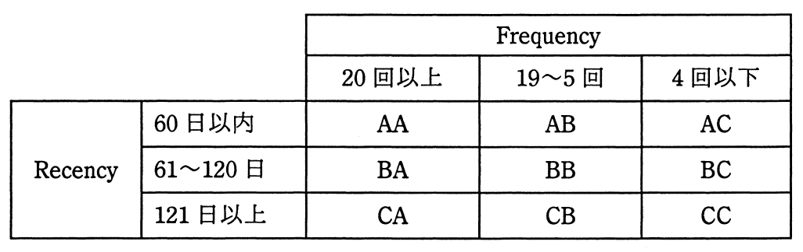

# 平成28年度秋期 問69（ストラテジ）

## 問題文

RFM分析において，特にR（Recency）とF（Frequency）をそれぞれ三つに分類した。表の各セルに対する考察のうち，適切なものはどれか。

ア　AAに分類される顧客には，2度目以降の再購入を促進する特典提示や購入のお礼状が重要である。

イ　ACに分類される顧客には，コストを掛けてはならないので，マーケティング費用削減が重要である。

ウ　CAに分類される顧客は，離反しているおそれがあるので，離反していないかの調査が重要である。

エ　CCに分類される顧客に対しては，個人的なおもてなしを重視し，季節の挨拶などが重要である。

## 使用画像

## 解答と解説

**正解：ウ**

RFM分析は、顧客を最終購買日（Recency）、購買頻度（Frequency）、購買金額（Monetary）の3指標で分類し、顧客ごとの特性に応じたマーケティング施策を検討する手法である。本問の表では、RecencyをA（60日以内）～C（121日以上）、FrequencyをA（20回以上）～C（4回以下）で分類している。

CA（Recency=121日以上＝長期間購入がない、Frequency=20回以上＝購買頻度は高い）に分類される顧客は、かつては頻繁に購入していたが最近は購入がない、すなわち離反（既存顧客の喪失）の可能性がある顧客層である。したがって、離反していないか状況を調査し、必要に応じて再アプローチすることが重要になる。選択肢ウはこの分析を正しく述べている。

他の選択肢の誤りは以下のとおりである。
- ア：AA（直近購入あり・高頻度）は既に優良顧客として定着しており、再購入を促す特典よりも継続的な優遇・関係維持が重要である。
- イ：AC（直近購入あり・低頻度）は新規顧客の可能性が高く、まさにこれから育成すべき顧客層であり、マーケティング費用を削減すべき対象ではない。
- エ：CC（長期間購入なし・低頻度）は離反した可能性が高い顧客層であり、個人的なおもてなしよりも掘り起こし施策の優先度を見極める必要がある。

したがって正解はウである。

**IPA公式：ウ**
