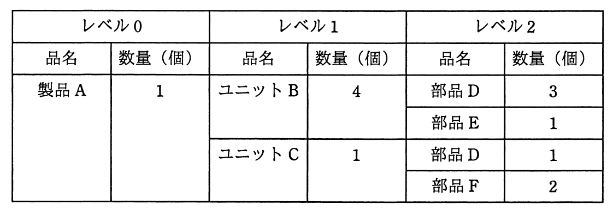

# 平成28年度秋期 問71（ストラテジ）

## 問題文

ある期間の生産計画において，図の部品表で表される製品Aの需要量が10個であるとき，部品Dの正味所要量は何個か。ここで，ユニットBの在庫残が5個，部品Dの在庫残が25個あり，他の在庫残，仕掛残，注文残，引当残などはないものとする。

ア　80

イ　90

ウ　95

エ　105

## 使用画像

## 解答と解説

**正解：イ**

部品表展開（MRP：資材所要量計画）の問題である。製品Aの需要量10個から、各部品の総所要量を階層的に計算し、在庫残を差し引いて正味所要量を求める。

- レベル1: ユニットBの総所要量 = 製品A(10) × 4 = 40個
- レベル2: 部品Dの総所要量は、ユニットB経由とユニットC経由の合計で計算する
  - ユニットCの総所要量 = 製品A(10) × 1 = 10個
  - ユニットBの正味所要量 = 総所要量40個 − 在庫残5個 = 35個（下位レベルの展開には正味所要量を用いる）
  - 部品D（ユニットB経由） = 35 × 3 = 105個
  - 部品D（ユニットC経由） = 10 × 1 = 10個
  - 部品Dの総所要量 = 105 + 10 = 115個
- 部品Dの正味所要量 = 総所要量115個 − 在庫残25個 = 90個

したがって正解は90個（イ）である。ユニットBの在庫を差し引かずに計算すると誤って105個（エ）や95個（ウ）などになりやすいため、どのレベルで在庫を控除するかに注意が必要である。

**IPA公式：イ**
