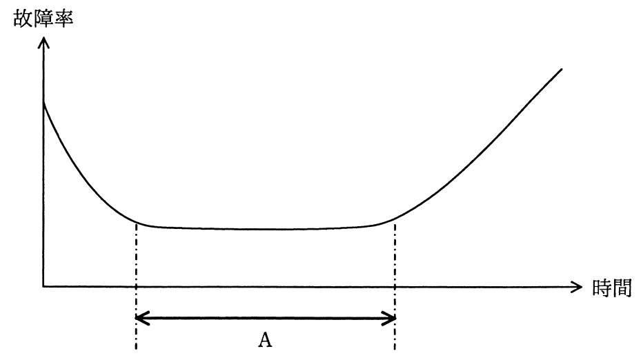

# 平成28年度秋期 問75（コンピュータシステム）

## 問題文

故障率曲線において，図中のAの期間に実施すべきことはどれか。

ア　設計段階では予想できなかった設計ミス，生産工程では発見できなかった欠陥などによって故障が発生するので，出荷前に試運転を行う。

イ　対象の機器・部品が，様々な環境条件の下で使用されているうちに，偶発的に故障が発生するので，予備部品などを用意しておく。

ウ　疲労・摩耗・劣化などの原因によって故障が発生するので，部品交換などの保全作業を行い，故障率を下げる。

エ　摩耗故障が多く発生してくるので，定期的に適切な保守を行うことによって事故を未然に防止する。

## 使用画像

## 解答と解説

**正解：イ**

故障率曲線（バスタブ曲線）は、機器・部品の時間経過に伴う故障率の変化を表すもので、以下の3つの期間に分かれる。

- 初期故障期：故障率が時間とともに減少していく期間。設計・製造上の欠陥（潜在的な不良）が原因で発生する故障が多く、出荷前のデバッグ・試運転（バーンイン）によって取り除くべき期間。
- 偶発故障期（図中のAの期間）：故障率がほぼ一定で低い水準を保つ期間。使用環境などの偶発的な要因によって、予測しにくい故障がランダムに発生する。この期間には予備部品を準備するなどの対応が有効。
- 摩耗故障期：時間経過とともに部品の摩耗・劣化が進み、故障率が再び上昇していく期間。定期保守・部品交換によって故障率を抑える必要がある。

図中のAは故障率が低い水準で安定している区間であるため、偶発故障期に該当する。この期間は偶発的な故障に備え、予備部品などを用意しておくことが適切な対応である。

各選択肢の対応は次の通り。

- ア：初期故障期における出荷前デバッグの説明。
- イ：偶発故障期における予備部品の準備の説明であり、Aの期間に該当する。
- ウ、エ：摩耗故障期における保全作業・定期保守の説明。

以上より、正解はイである。

**IPA公式：イ**
