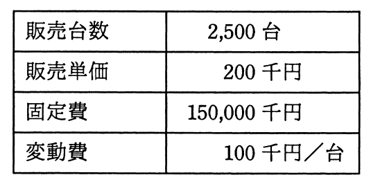

# 平成28年度秋期 問76（ストラテジ）

## 問題文

今年度のA社の販売実績と費用（固定費，変動費）を表に示す。来年度，固定費が5％増加し，販売単価が5％低下すると予測されるとき，今年度と同じ営業利益を確保するためには，最低何台を販売する必要があるか。

ア　2,575

イ　2,750

ウ　2,778

エ　2,862

## 使用画像

## 解答と解説

**正解：エ**

損益分岐点分析（CVP分析）を用いて、今年度の営業利益を求めた上で、来年度の条件変更後に同じ利益を確保するために必要な販売台数を計算する。

**今年度の営業利益**

- 売上高 = 販売台数2,500台 × 単価200千円 = 500,000千円
- 変動費 = 2,500台 × 100千円 = 250,000千円
- 固定費 = 150,000千円
- 営業利益 = 500,000 − 250,000 − 150,000 = 100,000千円

**来年度の条件**

- 固定費：5％増加 → 150,000 × 1.05 = 157,500千円
- 販売単価：5％低下 → 200 × 0.95 = 190千円
- 変動費：100千円/台（変更なしと仮定）

来年度の販売台数をx台とすると、営業利益の式は次のとおり。

190x − 100x − 157,500 = 100,000
90x = 257,500
x = 257,500 ÷ 90 = 2,861.1…

台数は整数かつ「今年度と同じ営業利益を確保する」ためには最低でもこの値以上必要なので、小数点以下を切り上げて2,862台となる。

以上より、正解はエである。

**IPA公式：エ**
