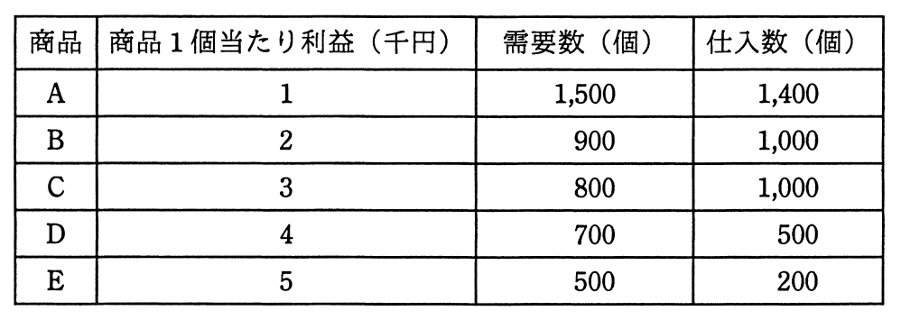

# 平成28年度秋期 問77（ストラテジ）

## 問題文

表の条件でA〜Eの商品を販売したときの機会損失は何千円か。

ア　800

イ　1,500

ウ　1,600

エ　2,400

## 使用画像

## 解答と解説

**正解：エ**

機会損失とは、需要はあったにもかかわらず在庫（仕入数）が不足していたために販売できなかったことで失われた利益のことである。需要数が仕入数を上回る商品についてのみ、その差分×1個当たり利益が機会損失として発生する。仕入数が需要数以上の商品では、売れ残りは発生し得るが機会損失（販売できなかった利益）は発生しない。

商品ごとに計算すると以下のとおり。

- 商品A：需要1,500 − 仕入1,400 = 100個不足 → 機会損失 = 100 × 1千円 = 100千円
- 商品B：需要900 − 仕入1,000 = 仕入超過（不足なし） → 機会損失 = 0
- 商品C：需要800 − 仕入1,000 = 仕入超過（不足なし） → 機会損失 = 0
- 商品D：需要700 − 仕入500 = 200個不足 → 機会損失 = 200 × 4千円 = 800千円
- 商品E：需要500 − 仕入200 = 300個不足 → 機会損失 = 300 × 5千円 = 1,500千円

合計機会損失 = 100 + 0 + 0 + 800 + 1,500 = 2,400千円

以上より、正解はエである。

**IPA公式：エ**
