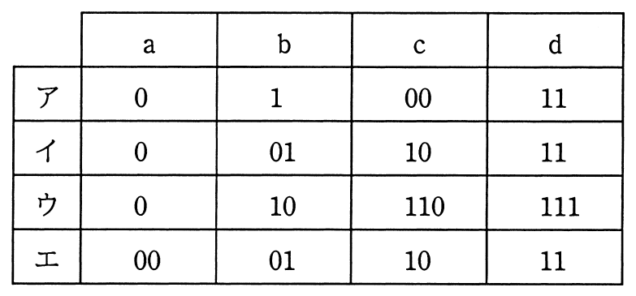

# 平成28年度春期 問4（基礎理論）

## 問題文

a，b，c，dの4文字から成るメッセージを符号化してビット列にする方法として表のア〜エの4通りを考えた。この表はa，b，c，dの各1文字を符号化するときのビット列を表している。メッセージ中でのa，b，c，dの出現頻度は，それぞれ50％，30％，10％，10％であることが分かっている。符号化されたビット列から元のメッセージが一意に復号可能であって，ビット列の長さが最も短くなるものはどれか。

## 使用画像

## 解答と解説

**正解：ウ**

画像の表は、a, b, c, dの4文字に対する4通りの符号化方式（ア〜エ）を示している。出現頻度はa=50%, b=30%, c=10%, d=10%である。

まず、一意復号可能かどうか（プレフィックス符号になっているか）を確認する。
- ア：a=0, c=00 で、aの符号「0」がcの符号「00」の先頭と一致（プレフィックス）しており、一意に復号できない。
- イ：a=0, b=01 で、aの符号「0」がbの符号「01」のプレフィックスになっており、一意に復号できない。
- ウ：a=0, b=10, c=110, d=111 → いずれの符号も他の符号のプレフィックスになっておらず、一意復号可能（プレフィックス符号）である。
- エ：a=00, b=01, c=10, d=11 → 固定長2ビットでプレフィックス符号であり、一意復号可能である。

一意復号可能なのはウとエなので、両者の平均符号長を比較する。

ウの平均符号長 = 1×0.5 + 2×0.3 + 3×0.1 + 3×0.1 = 0.5 + 0.6 + 0.3 + 0.3 = 1.7ビット

エの平均符号長 = 2×0.5 + 2×0.3 + 2×0.1 + 2×0.1 = 2.0ビット（固定長のため常に2ビット）

ウ（1.7ビット）の方がエ（2.0ビット）より平均符号長が短く、出現頻度の高い文字ほど短い符号を割り当てるハフマン符号化的な発想に合致している。

よって、一意復号可能で最も短くなるのはウである。

**IPA公式：ウ**

