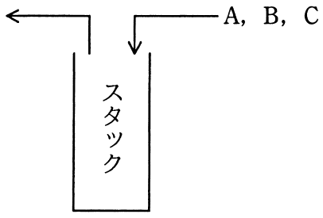

# 平成28年度春期 問5（基礎理論）

## 問題文

A，B，Cの順序で入力されるデータがある。各データについてスタックへの挿入と取出しを1回ずつ行うことができる場合，データの出力順序は何通りあるか。

ア　3

イ　4

ウ　5

エ　6

## 使用画像

## 解答と解説

**正解：ウ**

画像はA, B, Cの順にスタックへ挿入され、任意のタイミングで取り出せることを示している。スタックはLIFO（後入れ先出し）構造であるため、挿入と取出しのタイミングの組合せによって、出力順序のパターンが決まる。

すべての可能な出力順序を列挙する。3個のデータをスタック経由で並べ替える場合の出力パターン数は、カタラン数 C(n) = (2n)!/((n+1)!n!) で求められ、n=3のとき C(3) = 6!/(4!×3!) = 720/144 = 5 通りとなる。

具体的な出力順序を確認すると、ABC, ACB, BAC, BCA, CBAの5通りが実現可能である。一方、CABはスタックの構造上実現不可能である（Cを先に取り出すにはA, Bが先に入っていて後から取り出されない必要があるが、Cを最初に取り出す時点でAとBはまだスタック内に残っており、次に取り出せるのはBのみでAは取り出せない、という制約と矛盾するため）。

したがって、実現可能な出力順序は5通りであり、正解はウとなる。

**IPA公式：ウ**

