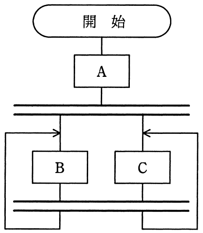

# 平成28年度春期 問6（基礎理論）

## 問題文

流れ図に示す処理の動作の記述として，適切なものはどれか。ここで，二重線は並列処理の同期を表す。

ア　ABC又はACBを実行してデッドロックになる。

イ　AB又はACを実行してデッドロックになる。

ウ　Aの後にBC又はCB，BC又はCB，…と繰り返して実行する。

エ　Aの後にBの無限ループ又はCの無限ループになる。

## 使用画像

## 解答と解説

**正解：ウ**

画像の流れ図は、「開始」の後にAを実行し、その後二重線（並列処理の同期線）を経てBとCが並列に分岐し、両方が完了すると再び二重線で同期し、その後また分岐して…という構造がループしている。

二重線は「そこに到達した全ての分岐が揃うまで待つ（フォークとジョインによる同期）」を表す。したがってAの実行後、BとCが並列に開始され、両方の処理が完了した時点（同期線）で再びBとCが並列に開始される、という流れを繰り返す構造になっている。

これは「Aの後にBC又はCB（並列実行なので実行順序は不定だが両方完了してから次に進む）を繰り返し実行する」という動作を表しており、ウの記述と一致する。

誤答選択肢について：ア・イはデッドロックになるという記述だが、この流れ図は同期線によって正しくフォーク・ジョインが行われる構造であり、デッドロックは発生しない。エは無限ループになるとしているが、片方だけが無限に実行されるのではなく、BとCの両方が毎回同期しながら繰り返し実行される点で異なる。

**IPA公式：ウ**

