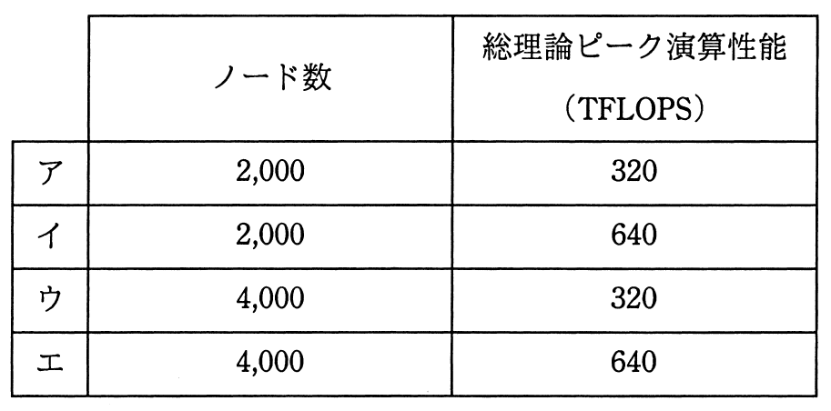

# 平成28年度春期 問13（コンピュータシステム）

## 問題文

現状のHPC（High Performance Computing）マシンの構成を，次の条件で更新することにした。更新後の，ノード数と総理論ピーク演算性能はどれか。ここで，総理論ピーク演算性能は，コア数に比例するものとする。

〔現状の構成〕

（1）一つのコアの理論ピーク演算性能は10GFLOPSである。

（2）一つのノードのコア数は8である。

（3）ノード数は1,000である。

〔更新条件〕

（1）一つのコアの理論ピーク演算性能を現状の2倍にする。

（2）一つのノードのコア数を現状の2倍にする。

（3）総コア数を現状の4倍にする。

## 使用画像

## 解答と解説

**正解：イ**

現状構成から総コア数と総理論ピーク演算性能を求め、更新条件を適用して計算する。

〔現状〕
- 1コアの性能：10GFLOPS
- 1ノードのコア数：8
- ノード数：1,000
- 総コア数：8×1,000＝8,000コア
- 総理論ピーク演算性能：10GFLOPS×8,000＝80,000GFLOPS＝80TFLOPS

〔更新後〕
- 1コアの性能：10GFLOPS×2＝20GFLOPS
- 1ノードのコア数：8×2＝16
- 総コア数：8,000×4＝32,000コア
- ノード数：32,000コア÷16コア/ノード＝2,000ノード
- 総理論ピーク演算性能：20GFLOPS×32,000＝640,000GFLOPS＝640TFLOPS

よって、ノード数は2,000、総理論ピーク演算性能は640TFLOPSとなり、表の選択肢イに一致する。

**IPA公式：イ**

