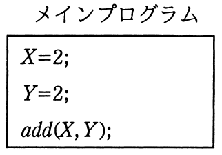
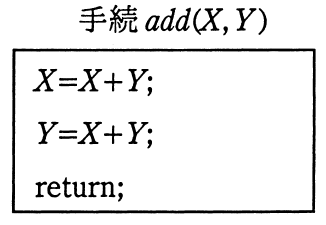
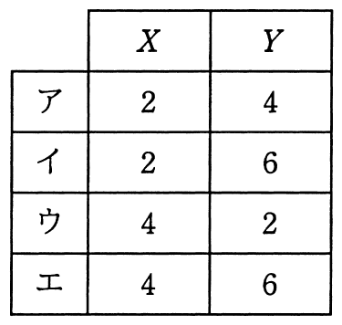

# 平成28年度春期 問20（基礎理論）

## 問題文

メインプログラムを実行した後，メインプログラムの変数X，Yの値は幾つになるか。ここで，仮引数Xは値呼出し（call by value），仮引数Yは参照呼出し（call by reference）であるとする。

## 使用画像

## 解答と解説

**正解：イ**

メインプログラムはX=2, Y=2としてadd(X, Y)を呼び出す。Xは値呼出し（call by value）なので手続add内のXは呼び出し元の値のコピーであり、手続内でXを変更してもメインプログラムのXには影響しない。一方、Yは参照呼出し（call by reference）なので、手続add内でYを変更するとメインプログラムのYも同じ変数として更新される。

手続add(X, Y)内の処理を追跡する。
1. X = X + Y = 2 + 2 = 4　（手続内のローカルなXが4になる。値呼出しのため呼び出し元Xには反映されない）
2. Y = X + Y = 4 + 2 = 6　（この時点の手続内Xは4、Yは2なので、4+2=6。Yは参照呼出しのため、呼び出し元のYも6になる）

手続の実行後、呼び出し元（メインプログラム）に戻ると、
- X：値呼出しのため変更は反映されず、元の2のまま
- Y：参照呼出しのため、手続内で更新された6が反映される

よって、メインプログラムのXは2、Yは6となり、選択肢イに一致する。

**IPA公式：イ**

