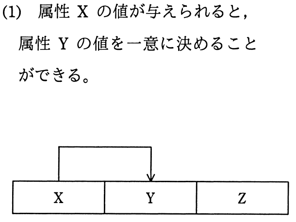
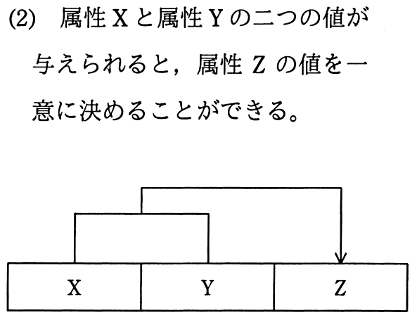
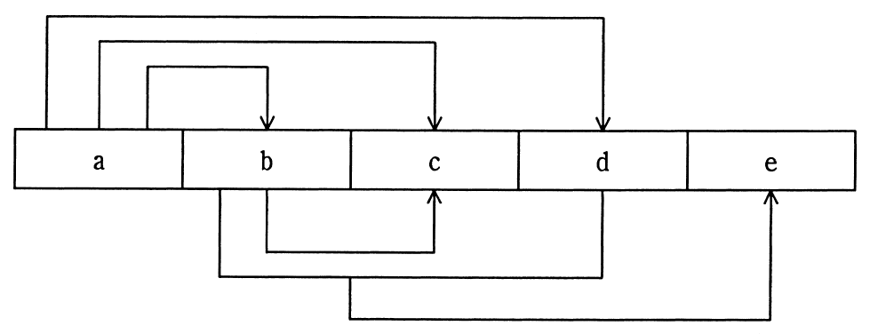
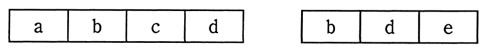
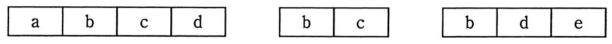
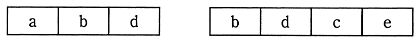
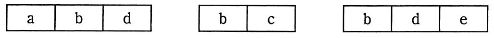

# 平成28年度春期 問27（技術要素）

## 問題文

関数従属を次のように表記するとき，属性a〜eで構成される関係を第3正規形にしたものはどれか。

〔関数従属〕

　

〔正規化する関係〕

ア　

イ　

ウ　

エ

## 使用画像

## 解答と解説

**正解：エ**

画像の関数従属図から、属性間の関数従属は次のように読み取れる。

- a → b、a → c、a → d（aの値が決まれば、b・c・dの値がそれぞれ一意に決まる）
- b → c（bの値が決まれば、cの値が一意に決まる）
- {b, d} → e（bとdの組の値が決まれば、eの値が一意に決まる）

まず候補キーを求める。a → b、a → d であるから a → {b, d} が成り立ち、{b, d} → e と合わせて推移的に a → e も成り立つ。したがって a 一つで b、c、d、e 全ての値が一意に決まるため、a が唯一の候補キー（主キー）となる。

次に第3正規形（3NF）の条件を確認する。3NFは「全ての非キー属性が、候補キーに完全関数従属し、かつ推移関数従属していない」ことを要求する。ここでは非キー属性b・c・d・eのうち、次の推移的関数従属が存在する。

- a → b → c（cはaに直接ではなく、bを介して推移的に従属している）
- a → {b, d} → e（eはaに直接ではなく、{b, d}を介して推移的に従属している）

これらの推移従属を解消するように関係を分解すると、次の3つの関係に分けられる。

- {a, b, d}（aを主キーとし、a→b、a→dを表す）
- {b, c}（b→cという推移従属部分を独立した関係として切り出す）
- {b, d, e}（{b,d}→eという推移従属部分を独立した関係として切り出す）

この分解では、{a,b,d}の非キー属性b・dはaに直接（非推移的に）従属し、{b,c}のcはbに直接従属し、{b,d,e}のeは{b,d}に直接従属するため、いずれの関係も推移関数従属を含まず3NFを満たす。この構成はエの組合せ（{a,b,d}、{b,c}、{b,d,e}）と一致する。したがってエが正しい。

ア（{a,b,c,d}、{b,d,e}）はaを含む関係にb→cの推移従属が残ったままであり、3NFの条件を満たさないため誤り。

イ（{a,b,c,d}、{b,c}、{b,d,e}）もaを含む関係に依然としてb→cの推移従属（cがaに対して推移的）が残っているため誤り。

ウ（{a,b,d}、{b,c}、{b,d,c,e}）は最後の関係{b,d,c,e}の中にb→cという推移従属が残ってしまっており、3NFを満たさないため誤り。

**IPA公式：エ**

