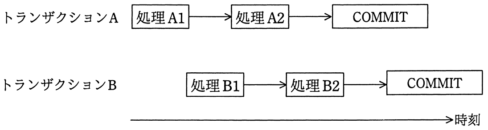
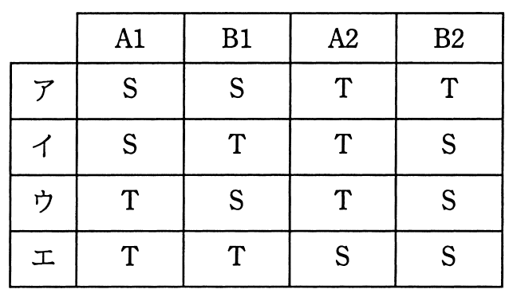

# 平成28年度春期 問28（技術要素）

## 問題文

トランザクションA（処理A1→処理A2の順に実行する）とトランザクションB（処理B1→処理B2の順に実行する）が，データベースの資源SとTに対し，次のように処理A1→処理B1→処理A2→処理B2の順で専有ロックを要求する場合，デッドロックが発生する資源の組合せはどれか。

　なお，ロックは処理開始時にかけ，トランザクション終了時に解除する。

## 使用画像

