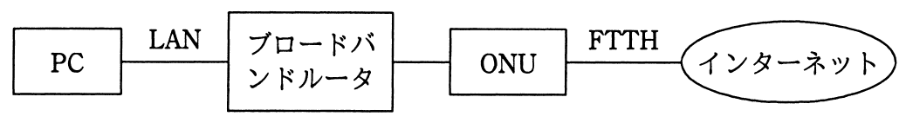

# 平成28年度春期 問32（技術要素）

## 問題文

100Mビット／秒のLANに接続されているブロードバンドルータ経由でインターネットを利用している。FTTHの実効速度が90Mビット／秒で，LANの伝送効率が80％のときに，LANに接続されたPCでインターネット上の540Mバイトのファイルをダウンロードするのに掛かる時間は，およそ何秒か。ここで，制御情報やブロードバンドルータの遅延時間などは考えず，また，インターネットは十分に高速であるものとする。

ア　43

イ　48

ウ　54

エ　60

## 使用画像

## 解答と解説

**正解：ウ**

ダウンロード経路は「インターネット（十分高速） → FTTH回線（実効速度90Mビット/秒） → ブロードバンドルータ → LAN（回線速度100Mビット/秒，伝送効率80％）→ PC」という構成である。

全体の転送速度は、経路上の各区間の実効速度のうち最も小さいものによって決まる（ボトルネックの原則）。

- FTTHの実効速度：90Mビット/秒（既に実効値として与えられている）
- LANの実効速度：LANの回線速度100Mビット/秒 × 伝送効率80％ ＝ 80Mビット/秒

両者を比較すると、LAN側の実効速度80Mビット/秒のほうが小さいため、これがボトルネックとなり、全体の実効転送速度は80Mビット/秒となる。

次に、ダウンロードするファイルサイズ540Mバイトをビットに変換する。
540Mバイト × 8（ビット/バイト）＝ 4,320Mビット

転送時間 ＝ ファイルサイズ（ビット）÷ 実効速度
4,320Mビット ÷ 80Mビット/秒 ＝ 54秒

したがって、ダウンロードに掛かる時間はおよそ54秒であり、正解はウである。

**IPA公式：ウ**

