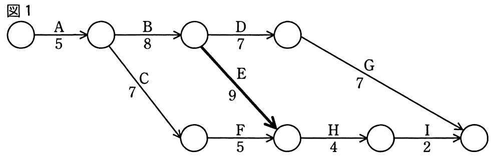
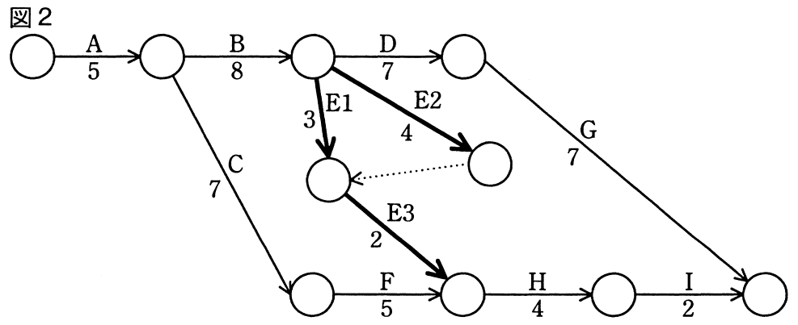
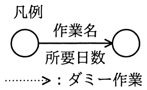

# 平成28年度春期 問53（マネジメント）

## 問題文

プロジェクトのスケジュールを短縮したい。当初の計画は図1のとおりである。作業Eを作業E1，E2，E3に分けて，図2のように計画を変更すると，スケジュールは全体で何日短縮できるか。

　

ア　1

イ　2

ウ　3

エ　4

## 使用画像

## 解答と解説

**正解：ア**

図1（変更前）について、開始から終了までの各経路の所要日数を計算する。

- A→B→D→G：5+8+7+7＝27日
- A→B→E→H→I：5+8+9+4+2＝28日
- A→C→F→H→I：5+7+5+4+2＝23日

最長経路（クリティカルパス）はA→B→E→H→Iの28日である。

図2（変更後）では、作業EがE1（3日）とE2（4日）に分岐し、両方が完了した時点（E2の終点からE1の終点へ合流する構成）でE3（2日）が開始する。この合流点に到達するまでの日数は、E1経由（3日）とE2経由（4日）のうち遅い方で決まるため、max(3, 4)＝4日。ここにE3の2日を加えると、B終了時点からE3終了までは4＋2＝6日となる。

- A→B→（E1/E2/E3）→H→I：5+8+6+4+2＝25日
- A→B→D→G：27日（変更なし）
- A→C→F→H→I：23日（変更なし）

E経路自体は28日から25日へ3日短縮されるが、これと並行して存在するA→B→D→Gの経路が27日のままであるため、変更後の全体の最長経路（クリティカルパス）はA→B→D→Gの27日に置き換わる。

したがって、プロジェクト全体の所要日数は当初の28日から27日へ短縮され、短縮できる日数は28－27＝1日である。E経路単体では3日短縮できるように見えても、並行するD→Gルートがボトルネックとなるため、全体としての短縮効果は1日にとどまる。

**IPA公式：ア**

