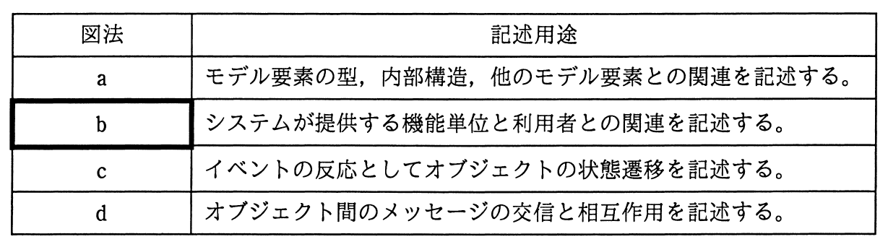

# 平成28年度春期 問66（ストラテジ）

## 問題文

表は，ビジネスプロセスをUMLで記述する際に使用される図法とその用途を示している。表中のbに相当する図法はどれか。ここで，ア〜エは，a〜dのいずれかに該当する。

ア　クラス図

イ　コラボレーション図

ウ　ステートチャート図

エ　ユースケース図

## 使用画像

## 解答と解説

**正解：エ**

表中のbの記述用途は「システムが提供する機能単位と利用者との関連を記述する」である。これはUMLにおける「ユースケース図」の定義そのものである。ユースケース図は，システムが提供する機能（ユースケース）と，それを利用するアクター（利用者）との関係を図示するものであり，要件定義やビジネスプロセスの整理においてシステムの機能範囲と利用者の関わりを可視化するために用いられる。

なお，表中の他の図法も併せて整理すると次のようになる。
- a「モデル要素の型，内部構造，他のモデル要素との関連を記述する」→ クラス図
- c「イベントの反応としてオブジェクトの状態遷移を記述する」→ ステートチャート図
- d「オブジェクト間のメッセージの交信と相互作用を記述する」→ コラボレーション図（またはシーケンス図）

選択肢を見ると，ア クラス図はa，イ コラボレーション図はd，ウ ステートチャート図はcに対応し，エ ユースケース図がbに対応する。

したがって，bに相当する図法はエのユースケース図である。

**IPA公式：エ**

