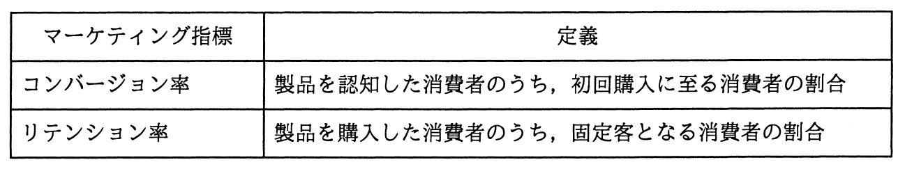

# 平成28年度春期 問69（ストラテジ）

## 問題文

ある製品における消費者の購買行動を分析した結果，コンバージョン率が低く，リテンション率が高いことが分かった。この場合に講じるべき施策はどれか。

ア　広告によって製品の認知度を高めても初回購入やリピート購入に結び付けられる可能性は低いと想定されるので，この製品の販売からの撤退を検討する。

イ　初回購入に至る消費者の心理的な障壁が高いことが想定されるので，無料サンプルの配布やお試し価格による提供などのセールスプロモーションを実施する。

ウ　製品の機能や性能と製品を購入した消費者の期待に差異があることが想定されるので，製品戦略を見直す。

エ　製品を購入した消費者が固定客化していることから現状のマーケティング戦略は効果的に機能していると判断できるので，新たな施策は不要である。

## 使用画像

