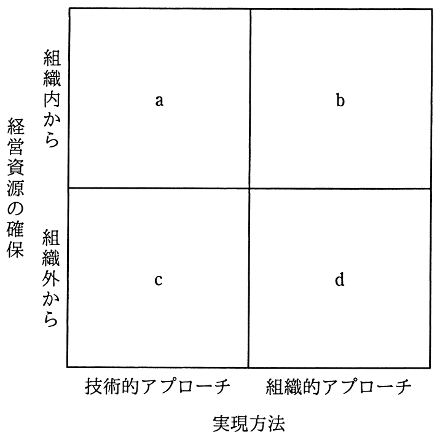

# 平成28年度春期 問71（ストラテジ）

## 問題文

製品開発のスピードアップ手法を次のa〜dに分類した場合，bに相当するものはどれか。ここで，ア〜エは，a〜dのいずれかに該当する。

ア　CAD，CAM，CAEなど既に一部利用しているツールの積極的な活用

イ　消費者ニーズを調査し，製品開発につなげるための市場調査会社の活用

ウ　設計部門と生産部門の作業を並列に進めるコンカレントエンジニアリング

エ　大学との共同研究開発や，同業他社からの技術導入

## 使用画像

## 解答と解説

**正解：ウ**

図は「経営資源の確保」（組織内から／組織外から）と「実現方法」（技術的アプローチ／組織的アプローチ）の2軸で製品開発スピードアップ手法を分類したマトリクスである。b は組織内から経営資源を確保し、組織的アプローチで実現する象限にあたる。

- a（組織内から・技術的アプローチ）：社内で既に保有・利用している設計支援ツールなどを積極活用する手法 → 選択肢ア（CAD/CAM/CAEの活用）に該当。
- b（組織内から・組織的アプローチ）：社内の複数部門の体制・進め方を組織的に見直して並行開発を進める手法 → 選択肢ウ（コンカレントエンジニアリング）に該当。設計部門と生産部門の作業を並列に進めるのは、社内組織の連携という組織的アプローチであり、社外資源に頼らない点で「組織内から」に分類される。
- c（組織外から・技術的アプローチ）：社外の技術シーズを技術面で取り込む手法 → 選択肢エ（大学との共同研究、他社からの技術導入）に該当。
- d（組織外から・組織的アプローチ）：社外の組織（市場調査会社など）と連携してニーズを取り込む手法 → 選択肢イ（市場調査会社の活用）に該当。

以上より、bに相当するのはウのコンカレントエンジニアリングである。

**IPA公式：ウ**

