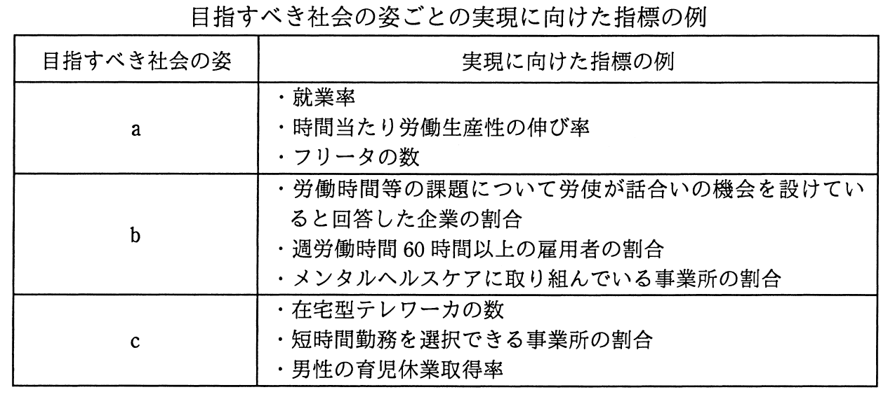

# 平成28年度春期 問76（ストラテジ）

## 問題文

内閣府によって取りまとめられた“仕事と生活の調和（ワーク・ライフ・バランス）憲章”及び“仕事と生活の調和推進のための行動指針”では，目指すべき社会の姿ごとに，その実現に向けた指標を設けている。次の表のcに当てはまるものはどれか。

ア　健康で豊かな生活のための時間が確保できる社会

イ　個々の社員のキャリア形成を企業が支援可能な社会

ウ　就労による経済的自立が可能な社会

エ　多様な働き方・生き方が選択できる社会

## 使用画像

## 解答と解説

**正解：エ**

“仕事と生活の調和（ワーク・ライフ・バランス）憲章”及び行動指針では、目指すべき社会の姿として複数の項目とその実現に向けた指標例が示されている。表中の項目cの指標例は「在宅型テレワーカの数」「短時間勤務を選択できる事業所の割合」「男性の育児休業取得率」であり、これらはいずれも働き方・生き方の柔軟な選択肢の広がりを測る指標である。

- a（就業率、労働生産性の伸び率、フリータの数）→ 就労による経済的自立の実現度を測る指標であり、選択肢ウ「就労による経済的自立が可能な社会」に対応する。
- b（労使の話合いの機会、週労働時間60時間以上の雇用者割合、メンタルヘルスケア）→ 働き過ぎを防ぎ健康を確保する指標であり、選択肢ア「健康で豊かな生活のための時間が確保できる社会」に対応する。
- c（在宅型テレワーカ数、短時間勤務の選択可否、男性の育児休業取得率）→ 個々人が働き方・生き方を柔軟に選べることを測る指標であり、選択肢エ「多様な働き方・生き方が選択できる社会」に対応する。

したがって、cに当てはまるものはエである。

**IPA公式：エ**

