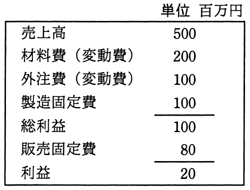

# 平成28年度春期 問77（ストラテジ）

## 問題文

損益計算資料から求められる損益分岐点売上高は，何百万円か。

ア　225

イ　300

ウ　450

エ　480

## 使用画像

## 解答と解説

**正解：ウ**

損益計算資料（単位：百万円）は次のとおり。

- 売上高：500
- 変動費：材料費200 ＋ 外注費100 ＝ 300
- 固定費：製造固定費100 ＋ 販売固定費80 ＝ 180
- 利益：20（検算：500－300－180＝20で一致）

損益分岐点売上高は「固定費 ÷ 限界利益率」で求める。

限界利益率 ＝（売上高－変動費）÷ 売上高 ＝（500－300）÷500 ＝ 200÷500 ＝ 0.4

損益分岐点売上高 ＝ 固定費 ÷ 限界利益率 ＝ 180 ÷ 0.4 ＝ 450（百万円）

したがって、損益分岐点売上高は450百万円であり、正解はウである。

**IPA公式：ウ**

