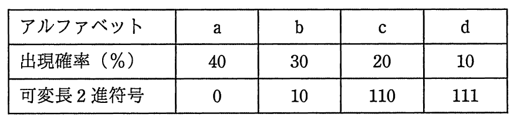

# 平成29年度秋期 問3（基礎理論）

## 問題文

四つのアルファベットa〜dから成るテキストがあり，各アルファベットは2ビットの固定長2進符号で符号化されている。このテキストにおける各アルファベットの出現確率を調べたところ，表のとおりであった。各アルファベットの符号を表のような可変長2進符号に変換する場合，符号化されたテキストの，変換前に対する変換後のビット列の長さの比は，およそ幾つか。

ア　0.75

イ　0.85

ウ　0.90

エ　0.95

## 使用画像

## 解答と解説

**正解：エ**

画像の表より、各アルファベットの出現確率と符号長は次のとおり。

| アルファベット | 出現確率 | 固定長符号 | 可変長符号 | 符号長（ビット） |
|---|---|---|---|---|
| a | 40% | 2ビット | 0 | 1 |
| b | 30% | 2ビット | 10 | 2 |
| c | 20% | 2ビット | 110 | 3 |
| d | 10% | 2ビット | 111 | 3 |

変換前は全て2ビット固定長なので、平均符号長は2ビット。

変換後の平均符号長（期待値）＝0.4×1＋0.3×2＋0.2×3＋0.1×3＝0.4＋0.6＋0.6＋0.3＝1.9ビット。

変換後／変換前の比＝1.9／2＝0.95。

したがって、ビット列長の比はおよそ0.95であり、選択肢エが正解。ア（0.75）、イ（0.85）、ウ（0.90）はこの計算結果より小さく、誤り。

**IPA公式：エ**

