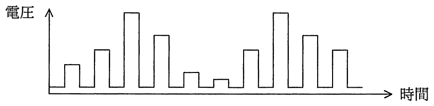
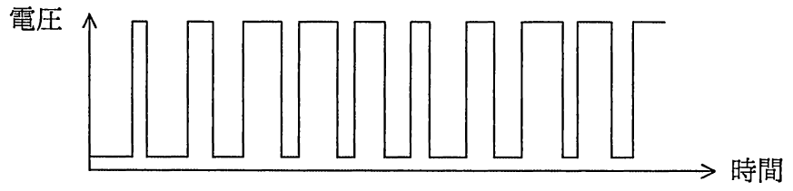
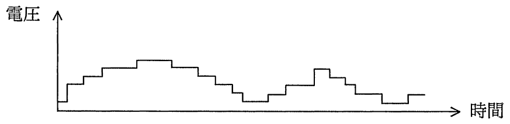
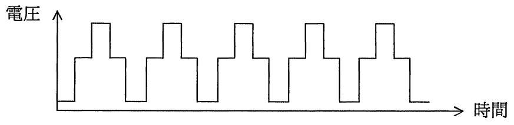

# 平成29年度秋期 問21（コンピュータシステム）

## 問題文

モータの速度制御などにPWM（Pulse Width Modulation）制御が用いられる。PWMの駆動波形を示したものはどれか。ここで，波形は制御回路のポート出力であり，低域通過フィルタを通していないものとする。

ア　

イ　

ウ　

エ

## 使用画像

## 解答と解説

**正解：イ**

PWM（Pulse Width Modulation：パルス幅変調）制御は、一定の周期（周波数）を保ったまま、パルスのオン時間（デューティ比）を変化させることで、モータへの平均印加電圧（実効的な出力）を制御する方式である。低域通過フィルタを通していないポート出力波形なので、方形波（矩形波）のまま観測される。

正しい波形の条件は、
- 周期（パルスの繰り返し間隔）が一定であること
- パルス幅（オン時間の比率）が変化してもよいこと（PWMの本質はここ）

画像イは、一定周期で方形波が繰り返され、オン幅（デューティ比）が変化している波形であり、典型的なPWM駆動波形である。

- ア：パルス幅・周期ともに不規則で、PWMの周期性の条件を満たさない。
- ウ：階段状に変化する波形で、パルス変調ではなくアナログ的な電圧変化に近い。
- エ：周期は一定だが、パルスが2段の高さ（3値）を持ち、PWM（2値のオン/オフ）の定義に合わない。

以上より、周期一定でデューティ比のみが変化する波形イが正解である。

**IPA公式：イ**
