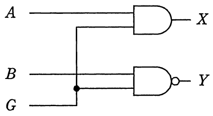
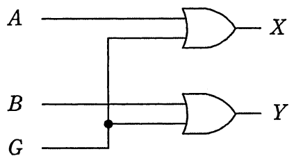
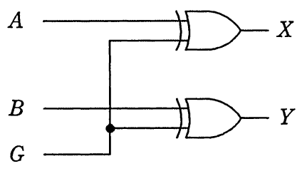
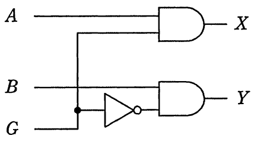

# 平成29年度秋期 問23（コンピュータシステム）

## 問題文

入力G＝0のときはX＝A，Y＝Bを出力し，G＝1のときはX＝A，Y＝Bを出力する回路はどれか。

ア　

イ　

ウ　

エ

## 使用画像

## 解答と解説

**正解：ウ**

求める回路は、G＝0のときX＝A，Y＝B、G＝1のときX＝A（バー：Aの否定），Y＝B（バー：Bの否定）を出力する回路である。つまり、G＝1のときはA，Bの信号を反転して出力し、G＝0のときはそのまま出力するという「排他的論理和（EXOR）」の性質そのものである。EXOR回路は、片方の入力を制御信号Gとしてもう片方の入力Aと組み合わせると、G＝0のとき出力はAそのまま、G＝1のとき出力はAの反転（否定）になるという特性を持つ。

画像ウの回路は、AとGの排他的論理和（XOR）ゲートでX出力を、BとGの排他的論理和（XOR）ゲートでY出力を生成しており、まさにG＝0でX＝A・Y＝B、G＝1でX＝A（否定）・Y＝B（否定）となる構成である。

- ア：AND／NANDゲートの構成で、Gが0のとき出力が0に固定されるなど、反転出力の条件を満たさない。
- イ：OR構成であり、Gが1のとき常に1になるなど、反転出力にはならない。
- エ：AND／NOT／ANDを組み合わせた回路で、EXORと異なる論理になる。

以上より、EXOR構成のウが正解である。

**IPA公式：ウ**
